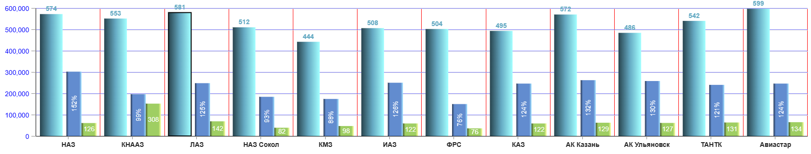
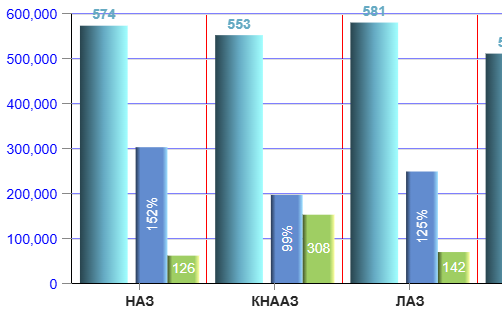
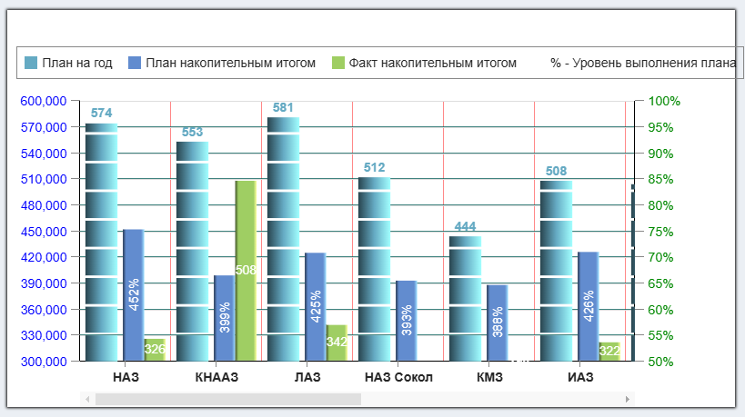

# BAR DIAGRAM

Компонента, которая строит столбчатую диаграмму 

````
<CoordinatesPanel {...} >
    <BarDiagram
        fractions={[...]}
        linkToScale="left"
        indicators={[...]}
    />
</CoordinatesPanel>
````

Компонента работает только если она является дочерней по
отношению к системе координат - компоненты
[CoordinatesPanel](../../CoordinatesPanel/doc/COORDINATESPANEL.md#coordinates-panel)

&emsp;\
&emsp;\
&emsp;\
&emsp;\
&emsp;

Параметры barDiagramProps:

## fractions

Массив данных, на основе которого строится диаграмма.

````
fractions = [obj1, obj2, ... objN];
````

Содержимое каждого объекта массива fractions никак не регламентируется

Никаких полей с обязательными ключами
не предусмотрено. Настройка какие именно данные должны отображаться
на диаграмме производится в другом месте, где задаются имена ключей
необходимых полей (см. **indicators**)

Возмём для примера вот такой массив **fractions**:

````
const fractions = [
    {text: 'НАЗ',          a: 574, b: 152, c: 126, d:  82, color: '#f00', e: 0.1, f: 22, i: ''},
    {text: 'КНААЗ',        a: 553, b:  99, c: 308, d: 110, color: '#f44', e: 0.2, f: 44, i: ''},
    {text: 'ЛАЗ',          a: 581, b: 125, c: 142, d: 114, color: '#f88', e: 0.3, f: 35, i: ''},
    {text: 'НАЗ Сокол',    a: 512, b:  93, c:  82, d:  88, color: '#fcc', e: 0.4, f: 12, i: ''},
    {text: 'КМЗ',          a: 444, b:  88, c:  98, d: 110, color: '#ff0', e: 0.2, f: 78, i: ''},
    {text: 'ИАЗ',          a: 508, b: 126, c: 122, d:  97, color: '#ff4', e: 0.8, f: 39, i: ''},
    {text: 'ФРС',          a: 504, b:  76, c:  76, d: 100, color: '#ff8', e: 0.4, f: 99, i: ''},
    {text: 'КАЗ',          a: 495, b: 124, c: 122, d:  98, color: '#ffc', e: 0.9, f: 11, i: ''},
    {text: 'АК Казань',    a: 572, b: 132, c: 129, d:  97, color: '#0ff', e: 0.7, f: 67, i: ''},
    {text: 'АК Ульяновск', a: 486, b: 130, c: 127, d:  97, color: '#4ff', e: 0.0, f: 70, i: ''},
    {text: 'ТАНТК',        a: 542, b: 121, c: 131, d: 108, color: '#8ff', e: 0.5, f: 53, i: ''},
    {text: 'Авиастар',     a: 599, b: 124, c: 134, d: 108, color: '#cff', e: 0.8, f: 67, i: ''},
]
````
## linkToScale

Может иметь два значения: "left" (по умолчению) или "right" и определяет, какая шкала измерения
должна использоваться для данного набота данных

подробнее смотри
[CoordinatesPanel](../../CoordinatesPanel/doc/COORDINATESPANEL.md#forleftscalevalueskey-forrightscalevalueskey)

## indicators

массив элементов, каждый из которого описывает какую именно слолбчатую диаграмму надо выводить

Количество диаграмм на одном поле может быть любым и определяется размерностью массива **indicators**

Допустим он у нас такой:

````
indicators={[
    {
        textRotate: 0,
        widthPercent: '10 60 5',
        valueKey: 'a',
        format: '[VALUE]',
        color: '#65aac3',
        type: 'cylinder',
        showValue: true,
        offsetPercent: 100,
        offsetNumber:  10,
        style: {},
        valueStyle: {fontWeight: 'bold', fill: '[COLOR]'}
        histogram: {portion: 10, gap: 1},
    },
    {
        textRotate: -90,
        widthPercent: '5 40  0',
        valueKey: 'b',
        format: '[VALUE]%',
        color: '#628ccf',
        type: 'oval',
        showValue: true,
        offsetPercent:  50,
        offsetNumber:   0,
        style: {},
        valueStyle: {fill: '#fff'}
    },
    {
        textRotate: 0,
        widthPercent: '0 40 10',
        valueKey: 'c',
        format: '[VALUE]',
        color: '#9fce63',
        type: 'oval',
        showValue: true,
        offsetPercent:  50,
        offsetNumber: 0,
        style: {},
        valueStyle: {fill: '#fff'}
    },
]}

````

В итоге мы получим вот такую диаграмму:


Итак, параметры **indicators**

### valueKey

Ключ элемента **fractions**, в котором лежит очередное значение отображаемой диаграммы

### showValue

Флаг отрисовки значения на диаграмме

### format

Строка, которая будет выводится, причём текст "[VALUE]" будет автоматически
заменяться соответствующим значением **fractions[i][valueKey]**

### textRotate

Поворот текста вокруг своего центра

### color

Цвет отображаемой диаграммы

### widthPercent

О, это хитрая штука. При помощи неё мы можем определить каким образом размещать 
несколько диаграмм на одном поле

Соберём вместе этот параметр для наглядности

````
1) widthPercent: '10 60 5',
2) widthPercent: '5 40  0',
3) widthPercent: '0 40 10',
````

Всё очень просто. Каждый widthPercent имеет три числа, разделённых пробелами

- Первое число - отступ слева
- Второе число - ширина
- Третье число - отступ справа

Причём отступы могут быть отрицательными!!!

Итак, просуммируем все 9 чисел: 10+60+5 + 5+40+0 + 0+40+10 = 170. Так вот, 170 - это 100% ширины 
области отрисовки. Соответственно мы можем посчитать сколько % для каждого элемента составляют
отступы и ширина. Думаю, дальше объяснять не имеет смысла

### type

Если этот параметр присутствует, то элемент не просто окрашивается заданным цветом, а заливается
градиентом

На данный момент **type** может принимать два значения: "cylinder" (первый столбец)
и "oval" (второй и третий столбцы)


### offsetPercent, offsetNumber


Эти два параметра определяют позицию поясняющего текста над столбцом

Текст лежит всегда на вертикальной прямой, лежащей по центру столбца.
Но на каком именно месте?

Это место задаётся этими двумя параметрами

**offsetPercent** - относительное удаление. Если = 0 - то это низ столбца,
если = 100 - это верх столбцас, 50 (по умолчанию) - ровно посередине
(по центру столбца)

**offsetNumber** - абсолютная прибавка в пикселях (по умолчанию = 0)

### style

Дополнительные кастомные стили самого столбца

### valueStyle

Дополнительные кастомные стили текстовой части

### histogram

Если есть необходимость отобразить стобей в виде гистограммы,
то такая возможность существует. За неё отвечает параметр **histogram**



````
histogram: {
    portion: 10,
    gap: 1
},
````

**portion** - высота элемента гистограммы в % от общей высоты координатной сетки

**gap** - размер промежутка между элементами гистограммы 
в % от общей высоты координатной сетки

