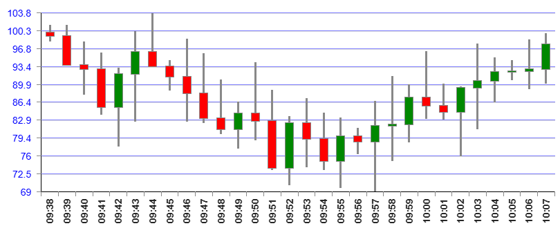

# CANDLESTICK

Компонента отрисовки чарта "японские свечи"

````
const fractions = [
    {time: "09:34", open: 99.85, high: 101.03, low: 94.27, close: 94.56},
    {time: "09:35", open: 94.56, high: 103.80, low: 86.44, close: 87.49},
    ...
]
````


````
    <CoordinatesPanel
        scaleYLeft={{
            valuesMaxKey: 'high',
            valuesMinKey: 'low',
        }}
        ...
    >
        <Candlestick
            linkToScale="left"
            fractions={fractions}
            openKey="open"
            closeKey="close"
            lowKey="low"
            highKey="high"
            bullColor="#080"
            bearColor="#f00"
            style={{}}
            className=""
        />
    </CoordinatesPanel>
````



Компонента работает только если она является дочерней по
отношению к системе координат - компоненты
[CoordinatesPanel](../../CoordinatesPanel/doc/COORDINATESPANEL.md#coordinates-panel)

Для построения тепловой карты требуется явное указание значений **шкалы X**. Для этого
используется параметр **fixValues** в координатной сетке. В нём размещается массив значений
горизонтальной шкалы. Размерность этого массива определяет ширину тепловой карты.

## Параметры

## linkToScale
Аналогично [BarDiagram](../../BarDiagram/doc/bardiagram.md#linktoscale)

## fractions
Аналогично [BarDiagram](../../BarDiagram/doc/bardiagram.md#fractions)

## openKey
Ключ элемента массива **fractions**, по которому лежит значение курса при открытии торгов


## closeKey
Ключ элемента массива **fractions**, по которому лежит значение курса при закрытии торгов


## lowKey
Ключ элемента массива **fractions**, по которому лежит максимальное значение курса
за время торгов

## highKey
Ключ элемента массива **fractions**, по которому лежит ьштшьальное значение курса
за время торгов

## bullColor
Цвет свечи, у которой курс закрытия больше курса открытия торгов

## bearColor
Цвет свечи, у которой курс закрытия меньше курса открытия торгов

### style
Дополнительные кастомные стили чарта

### className
Дополнительные кастомные классы чарта


