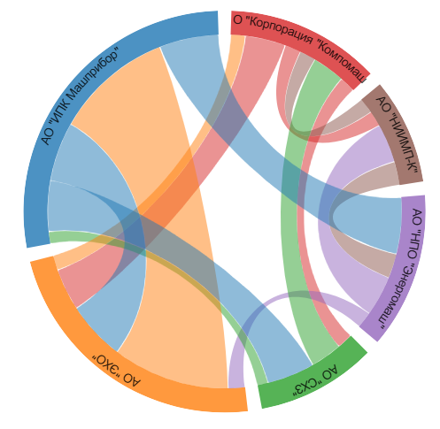

# CHORDS

Компонента, которая строит чарт **Хорды**

````
const fractions = [
    {org: 'AO "Корпорация "Компомаш"',  color: '#d62728', values: [     0, 100000,      0, 100000, 250000,      0]},
    {org: 'AO "НИИМП-К"',               color: '#8c564b', values: [100000,      0, 150000,      0,      0,      0]},
    {org: 'АО "НПО "Энергомаш"',        color: '#9467bd', values: [     0, 250000,      0,      0, 100000,      0]},
    {org: 'АО "СХЗ"',                   color: '#2ca02c', values: [200000,      0,      0,      0,      0,  70000]},
    {org: 'АО "ЭХО"',                   color: '#ff7f0e', values: [ 90000,      0,      0,      0,      0, 700000]},
    {org: 'АО "ИПК Машприбор"',         color: '#1f77b4', values: [     0,      0, 350000, 300000, 350000,      0]},
];

return (
    <div className="chords-test">
        <Chart fractions={fractions}>
            <Chords
                dataKey="values"
                colorKey="color"
                labelKey="org"
                sectorBorderAngleGap={2}
                ringWidthPercent={6}
                rotate={-90}
                dyText={1}
                className="aaa bbb ccc"
                fontSize={14}
                optimizeShortLinksFirst={false}
                oneDirectionalChords={true}
            />
        </Chart>
    </div>
)
````


## Параметры

## fractions
Основной массив данных, на основе которого строится чарт

Аналогично [BarDiagram](../../BarDiagram/doc/bardiagram.md#fractions)

### dataKey
Ключ элемента массива **fractions**, по которому лежат массивы с данными, на основе которых
строятся хорды. Размерность этих массивов должна совпадать с размерностью **fractions**

### colorKey
Ключ элемента массива **fractions**, по которому лежит цвет элемента

### labelKey
Ключ элемента массива **fractions**, по которому лежит название элемента

### sectorBorderAngleGap
Задаёт отклонение начального и конечного углов сектора в градусах

Аналогично [RingDiagram](../../RingDiagram/doc/ringdiagram.md#sectorborderanglegap)

### ringWidthPercent
Толщина кольца в процентах от диаметра круга

### rotate
Угол поворота кольца

### dyText
Смещение текста по направлению к центру относительно внешнего круга

### className
Дополнительные кастомные классы чарта

### fontSize
Размер текста в пикселях

### optimizeShortLinksFirst
Флаг последовательности оптимизации расположения хорд. Выше приведён пример оптимизации
хорд в порядке от длинных к коротким

А вот тот-же график при оптимизации последовательности от коротких к длинным
**(optimizeShortLinksFirst === true)**


### oneDirectionalChords
Флаг, определяющий способ отображения хорд.

Если **oneDirectionalChords ==== true**, то на графике отображаются все хорды от i-го к j-му элемента как отдельные
единицы. В этом случае ширина примыкания хорды к кольцу с обоих сторон будет одинаковой, в зависимости от значения

Если **oneDirectionalChords ==== false**, то компонента считает парные элементы таблицы (i-го к j-му и j-го к i-му)
как элементы, описывающие одну хорду. В этом случае ширина примыкания к кольцу на двух сторонах
будет разной, в зависимости от значений


| TRUE                                     | FALSE                    |
|------------------------------------------|--------------------------|
|                       |   |


