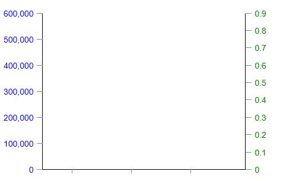
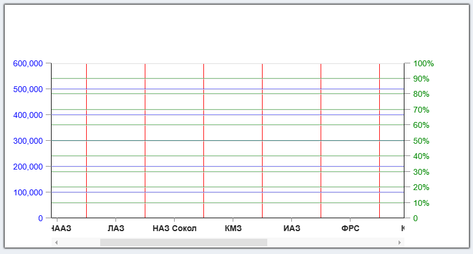

# COORDINATES PANEL

Компонента, предназначенная для отрисовки системы координат, внутри которой могут отрисовываться
различные диаграммы, требующие наличия этой самой системы координат
````
<CoordinatesPanel {...coordinatesPanelProps} />
    // элементы 
    <CoordinatesPanelGridX {...gridXProps} />
    <CoordinatesPanelGridYLeft {...gridYLeftProps} />
    <CoordinatesPanelGridYRight {...gridYRightProps} />
    <CoordinatesPanelScaleX {...scaleXProps} />
    <CoordinatesPanelScaleYLeft {...scaleYLeftProps} />
    <CoordinatesPanelScaleYRight {...scaleYRightProps} />
  диаграммы, например BarDiagram, GraphDiagram и т.д.
</CoordinatesPanel>
````

## Дочерние компоненты CoordinatesPanel

| Компонента                                                  | Назначение                                                              |
|-------------------------------------------------------------|-------------------------------------------------------------------------|
| [CoordinatesPanelScaleX](#coordinatespanelscalex)           | Отрисовывает шкалу X (горизонтальную)                                   |
| [CoordinatesPanelScaleYLeft](#coordinatespanelscaleyleft)   | Отрисоавывает шкалу Y с левой стороны системы координат (вертикальную)  |
| [CoordinatesPanelScaleYRight](#coordinatespanelscaleyright) | Отрисоавывает шкалу Y с правой стороны системы координат (вертикальную) |
| [CoordinatesPanelGridX](#coordinatespanelgridx)             | Отрисовывает вертикальные линии сетки                                   |
| [CoordinatesPanelGridYLeft](#coordinatespanelgridyleft)     | Отрисовывает горизонтальные линии сетки, привязанной к левой шкале      |
| [CoordinatesPanelGridYRight](#coordinatespanelgridyright)   | Отрисовывает горизонтальные линии сетки, привязанной к правой шкале     |


## coordinatesPanelProps

````
coordinatesPanelProps: {
    fractions = [...],
    scaleYLeft={{
        valuesKey: 'town',
        valuesMaxKey: 'high',
        valuesMinKey: 'low',
        maxValue: 700,
        minValue: 100,
        gridStepsNumber: 10,
        decimalPlacesNumber: 0,
        scaleType: 'area',
        fixValues: ['Январь', 'Февраль', 'Март', 'Апрель', 'Май'],
    }}
    scaleYRight={{
        ...
    }}
    style: {...},
    minFractionWidth: 100,
    scaleTypeX: 'area',
    mainWindowOverflow: 'auto'
}
````

### fractions

Массив данных, на основе которого строится система координат

````
fractions = [obj1, obj2, ... objN];
````

Содержимое каждого объекта массива fractions никак не регламентируется

Никаких полей с обязательными ключами
не предусмотрено. Настройка какие именно данные будут испоользоваться
для построения системы координат производится в другом месте, где задаются имена ключей
необходимых полей (см. **scaleYLeft** и **scaleYRight**)

### scaleYLeft, scaleYRight

В самом начале своей работы компонента **CoordinatesPanel** должна посчитать максимальное значение
по шкале Y так как это значение потребуется для любой другой дочерней компоненте.

Необходимо рассчитать маскимальное значение, количество контрольных точек на шкале Y и, 
соответственно, шаг между этими точками.

Также сразу надо отметить что на системе координат может присутствовать две шкалы Y, которые
отлисовываются одна с левой (основная и наиболее часто используемая), а другая - с правой стороны
(дополнительная, применяется довольно редко)

Возмём для примера вот такой массив **fractions**:

````
const fractions = [
    {text: 'НАЗ',          a: 574, b: 152, c: 126, d:  82, color: '#f00', e: 0.1, f: 22},
    {text: 'КНААЗ',        a: 553, b:  99, c: 308, d: 110, color: '#f44', e: 0.2, f: 44},
    {text: 'ЛАЗ',          a: 581, b: 125, c: 142, d: 114, color: '#f88', e: 0.3, f: 35},
    {text: 'НАЗ Сокол',    a: 512, b:  93, c:  82, d:  88, color: '#fcc', e: 0.4, f: 12},
    {text: 'КМЗ',          a: 444, b:  88, c:  98, d: 110, color: '#ff0', e: 0.2, f: 78},
    {text: 'ИАЗ',          a: 508, b: 126, c: 122, d:  97, color: '#ff4', e: 0.8, f: 39},
    {text: 'ФРС',          a: 504, b:  76, c:  76, d: 100, color: '#ff8', e: 0.4, f: 99},
    {text: 'КАЗ',          a: 495, b: 124, c: 122, d:  98, color: '#ffc', e: 0.9, f: 11},
    {text: 'АК Казань',    a: 572, b: 132, c: 129, d:  97, color: '#0ff', e: 0.7, f: 67},
    {text: 'АК Ульяновск', a: 486, b: 130, c: 127, d:  97, color: '#4ff', e: 0.0, f: 70},
    {text: 'ТАНТК',        a: 542, b: 121, c: 131, d: 108, color: '#8ff', e: 0.5, f: 53},
    {text: 'Авиастар',     a: 599, b: 124, c: 134, d: 108, color: '#cff', e: 0.8, f: 67},
]
````

Так вот, если мы отрисовываем какой-то график и хотим построить его с левой шкалой Y, то мы говорим,
какие данные из **fractions** у нас будут отображаться. Допустим эти данные в нашем примере 
находятся в поле **"a"**. Тогда мы используем параметр **valuesKey**

Если у нас будет еще и правая шкала, мы говорим какие данные определяют её размеры:

````
scaleYLeft={{
    valuesKey: 'a',
}}
scaleYRight={{
    valuesKey: 'e',
}}
````



Компонента сама находит максимальное значение. Минимальное при этом приравнивается к нулю
(это удобно, например, для столбчатой диаграммы)

Если на панели будет выводится некая информация, которая имеет не только верхнее значение,
но и нижнее (например, яонские свечи) То тогда важно знать не только макимальное
значение (верхняя тень), но и минимальное (нижняя тень). В этом случае хорошо-бы вычислить
минимальное значение шкалы по столбцу нижних теней, а максимальное - по столбцу значений верхних теней.

Для этого служат два параметра - **valuesMaxKey** и **valuesMinKey**. Это ключи
столбцов из **fractions**, в которых лежат максимальные и минимальные значения


Если мы сами хотим установить фиксированные максимальное и минимальное значения шкалы,
то в этом случае в нашем
распоряжении еще два параметра: **maxValue** и **maxValue**

Плюс к этому мы можем указать на какое количество частей необходимо разбить шкалу
(**gridStepsNumber**) и количество знаков округления значений шкалы (**decimalPlacesNumber**)


**scaleType** - тип шкалы. Может принимать одно из двух значений: "**line**" (по умолчанию)
и "**area**". Подробнее смотри **scaleTypeX**

Если мы строим какой-то чарт, который имеет вертикальную шкалу не с числовыми значениями,
а с неким набором текста, в этом случае мы можем использовать параметр **fixValues**

Этот параметр имеет приоритет над всеми остальными, поэтому надо иметь ввиду, что
с такой шкалой **Y** можно построить далеко не всякий тип чартов (например столбчатую диаграмму
или функцию)

Итого:

| Параметр            | Назначение                                                     |
|---------------------|----------------------------------------------------------------|
| valuesKey           | расчёт максимального значения при минимальном = 0              |
| valuesMaxKey        | расчёт максимального значения шкалы                            |
| valuesMinKey        | расчёт минимального значения шкалы                             |
| maxValue            | фмксированное максимальное значение шкалы                      |
| minValue            | фмксированное минимальное значение шкалы                       |
| gridStepsNumber     | на какое количество частей разбивать шкалу                     |
| decimalPlacesNumber | сколько знаков после запятой оставлять в случае нецелого числа |
| scaleType           | "left" / "right" - расположение шкалы                          |
| fixValues           | набор текстовых значений шкалы                                 |


### style

Дополнительные кастомные стили для системы координат

### minFractionWidth

Минимальное расстояние между точками шкалы X (по ширине). Если с таким значением всё содержимое 
не будет входить в отведённое окно, автоматически появится скроллбар, который позволит скролировать
содержимое по горизонтали

### scaleTypeX

Компонента поддерживает два вида отображения информации

#### scaleTypeX = "area"

Допустим мы будем отрисовывать столбчатую диаграмму. В этом случае всё пространство по шкале X будет
разбито на нужное количество областей, в каждой из которых будет отрисовываться некий
столбец или еще что-то там

#### scaleTypeX = "line"

А этот тип для отображения, допустим, линейного графика. Там не нужны области, там нужны
вертикальные линии, на каждой из которых будет отображено некое значение в виде точки, кружочка или квадратика
и все они между собой будут как-то соеденены

Так вот, в этом случае первая линия буде совпадать с левым краем области отображения, а последняя - с правым

### mainWindowOverflow

Мы уже говорили, что если по ширине содержимое не входит в родительское окно, то появляется скроллбар

Вместе с появлением скроллбара родительское окно будет иметь свойство **"overflow: hidden"**. 
А если содержимое входит, то родительское окно по умолчанию (или **mainWindowOverflow === 'auto'**)
не будет иметь этого свойства

Если поставить **mainWindowOverflow === 'always'**, то родительское окно признак **"overflow: hidden"**
будет иметь всегда

[В начало документа](#coordinates-panel)

# Дочерние компоненты


## CoordinatesPanelScaleX
````
<CoordinatesPanelScaleX
    height={50}
    rowKey="text"
    dash={true}
    textRotate={-45}
    style={{fontWeight: 'bold'}}
/>
````
Отрисовывает горизонтальную шкалу X (чёрная на скриншоте)

Параметры:

| Параметр         | Назначение                                                                       |
|------------------|----------------------------------------------------------------------------------|
| **rowKey**       | ключ элемента массива **fractions** в котором лежит текст, отображаемый на шкале |
| **height**       | высота области шкалы                                                             |
| **dash**         | флаг отображения маленьких чёрточек                                              |
| **textRotate**   | угол поворота текста (имеет смысл от 0 до -90)                                   |
| **style**        | дополнительные кастомные стили                                                   |
## CoordinatesPanelScaleYLeft
````
<CoordinatesPanelScaleYLeft
    width={70}
    format="[VALUE],000"
    dash={true}
    style={{color: '#00f'}}
/>
````
Отрисовывает шкалу Y с левой стороны системы координат (синяя на скриншоте)

Параметры:

| Параметр   | Назначение                                                                                                                      |
|------------|---------------------------------------------------------------------------------------------------------------------------------|
| **width**  | ширина области шкалы                                                                                                            |
| **format** | текст, выводимый на шкале, причём контекст "**[VALUE]**" будет автоматически заменён на соответствующее значение элемента шкалы |
| **dash**   | флаг отображения маленьких чёрточек                                                                                             |
| **style**  | дополнительные кастомные стили                                                                                                  |

## CoordinatesPanelScaleYRight
````
<CoordinatesPanelScaleYRight
    width={100}
    format="[VALUE]%"
    dash={true}
    style={{color: '#080'}}
/>
````
Отрисовывает шкалу Y с правой стороны системы координат (зелёная на скриншоте)

Параметры:

| Параметр   | Назначение                                                                                                                      |
|------------|---------------------------------------------------------------------------------------------------------------------------------|
| **width**  | ширина области шкалы                                                                                                            |
| **format** | текст, выводимый на шкале, причём контекст "**[VALUE]**" будет автоматически заменён на соответствующее значение элемента шкалы |
| **dash**   | флаг отображения маленьких чёрточек                                                                                             |
| **style**  | дополнительные кастомные стили                                                                                                  |


## CoordinatesPanelGridX
````
<CoordinatesPanelGridX
    style={{background: '#f00'}}
/>
````
Отрисовывает вертикальные линии сетки. Имеет на входе только один параметр **style** -
дополнительные кастомные стили линий (красные линии на скриншоте)

## CoordinatesPanelGridYLeft
````
<CoordinatesPanelGridYLeft
    style={{background: '#00f', opacity: .5}}
/>
````
Отрисовывает горизонтальные линии сетки, привязанной к левой шкале (синие линии на скриншоте)

## CoordinatesPanelGridYRight
````
<CoordinatesPanelGridYRight
    style={{background: '#080', opacity: .5}}
/>
````
Отрисовывает горизонтальные линии сетки, привязанной к правой шкале (зелёные линии на скриншоте)

[В начало документа](#coordinates-panel)