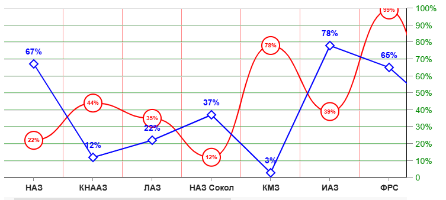

# GRAPH DIAGRAM

Компонента, которая строит график

````
<CoordinatesPanel {...} >
    <GraphDiagram
        fractions={[...]}
        linkToScale="left"
        indicators={[...]}
    />
</CoordinatesPanel>
````

Компонента работает только если она является дочерней по
отношению к системе координат - компоненты
[CoordinatesPanel](../../CoordinatesPanel/doc/COORDINATESPANEL.md#coordinates-panel)

&emsp;\
&emsp;\
&emsp;\
&emsp;\
&emsp;

Параметры graphDiagramProps:

## fractions
Аналогично [BarDiagram](../../BarDiagram/doc/bardiagram.md#fractions)

## linkToScale
Аналогично [BarDiagram](../../BarDiagram/doc/bardiagram.md#linktoscale)

## indicators
Аналогично [BarDiagram](../../BarDiagram/doc/bardiagram.md#indicators) за исключением
того, что отсутству


````
indicators={[
    {
        color: '#f00',
        valueKey: 'кеу',
        valueOffset: 0,
        valueFormat: '[VALUE]%',
        valueStyle: {fontSize: '10px', fontWeight: 'bold'},
        showValue: true,
        lineStyle: {},
        lineSplinePercent: 50,           // коэффициент сглаживания 0 - 100
        pointType: 'circle',             // circle / square / rhomb
        pointSize: 30,
        pointStyle: {},
    },
    ...
]}

````
### color

Цвет графика линий графика

### showValue

Флаг отрисовки текстовой подсказки около каждого узла графика

### valueKey

Ключ элемента **fractions**, в котором лежит очередное значение отображаемой диаграммы

### valueOffset

Текстовая подсказка всегда лежит на вертикальной прямой,
проходящей через узел графика. **valueOffset** определяет вертикальное смещение в пикселях
относительно узла

### valueFormat

Текст подсказки, которая будет выводится, причём текст "[VALUE]" будет автоматически
заменяться соответствующим значением **fractions[i][valueKey]**

### valueStyle

Дополнительные кастомные CSS-свойства для подсказки

### lineStyle

Дополнительные кастомные CSS-свойства для соединительной линии

### lineSplinePercent

Коэффициент сглаживания соединительных линий в процентах.

На скриншоте красный график имеет **lineSplinePercent** = 50, синий **lineSplinePercent** = 0

### pointType

Тип отображения узла:

| значение | тип                                       |
|----------|-------------------------------------------|
| "circle" | окружность                                |
| "square" | квадрат                                   |
| "rhomb"  | ромб (квадрат, повёрнутый на 45 градусов) |

### pointSize

Размер узла в пикселях

### pointStyle

Дополнительные кастомные CSS-свойства для узла


