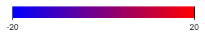
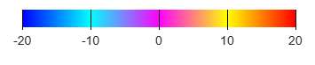
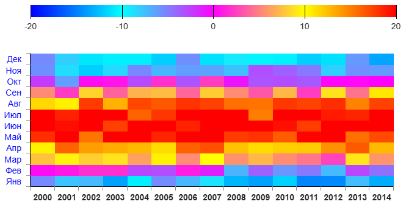
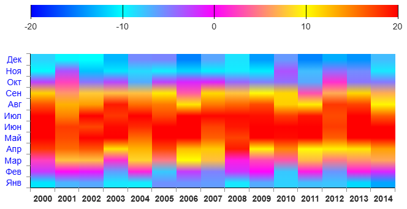
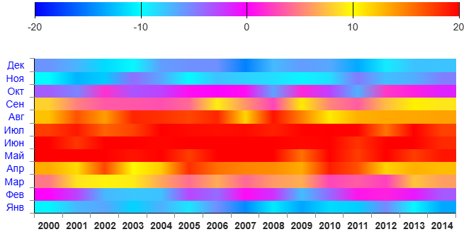
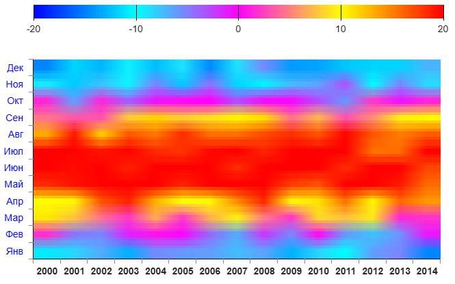
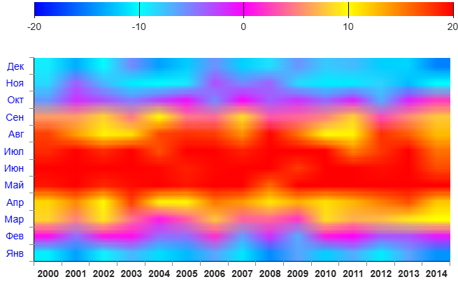
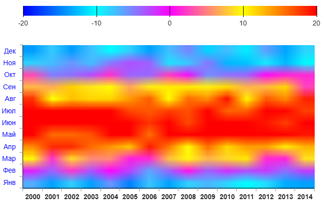

# HEATMAP

Компонента, которая строит тепловую карту

````
<CoordinatesPanel
    scaleYLeft={{
        fixValues: ['Янв', 'Фев', 'Мар', 'Апр', 'Май', 'Июн', 'Июл', 'Авг', 'Сен', 'Окт', 'Ноя', 'Дек'],
        scaleType: 'area',
    }}
>
    <Heatmap
        linkToScale="left"
        fractions={[
            {values: [10, 12, ...], ...},
            {values: [-1, 27, ...], ...},
            ...
        ]}
        valuesArrayKey="values"
        minValue={-30}
        maxValue={35}
        temperature={['#00f', '#0f0', '#ff0', '#f0f', '#0ff', '#00f', '#f00']}
        style={{...}}
        className="..."
        temperaturePanel={{
            show: true,
            type: 'vertical',
            style: {},
            className: '',
        }}
        smooth="extra-both",
    />
</CoordinatesPanel>
````

Компонента работает только если она является дочерней по
отношению к системе координат - компоненты
[CoordinatesPanel](../../CoordinatesPanel/doc/COORDINATESPANEL.md#coordinates-panel)

Для построения тепловой карты требуется явное указание значений **шкалы X**. Для этого
используется параметр **fixValues** в координатной сетке. В нём размещается массив значений
горизонтальной шкалы. Размерность этого массива определяет ширину тепловой карты.

## Параметры

## linkToScale
Аналогично [BarDiagram](../../BarDiagram/doc/bardiagram.md#linktoscale)

## fractions
Аналогично [BarDiagram](../../BarDiagram/doc/bardiagram.md#fractions)

### valuesArrayKey
Ключ элемента массива **fractions**, по которому лежат массивы с данными, на основе которых
строится тепловая карта. Размерность этих массивов должна совпадать с размерностью массива
**fixValues**, описанного выше

### minValue, maxValue

Минимальное и максимальное значения промежутка всех значений, которое мы хотим
раскрасить на тепловой карте. Если их не указывать (или одно из них), то компонента
самостоятельно вычислит их, перебрав все значения во **fractions[i][valuesArrayKey]**

### temperature
Массив цветов, соответствующих текущим значениям. Допустим, мы хотим
раскрасить цветами от синего до красного диапозон значений от
-20 до +20.

В этом случае:

````
minValue={-20}
maxValue={20}
temperature={['#00f', '#f00']}
````


Если нам надо больше цветов, то мы прописываем их тоже:
````
minValue={-20}
maxValue={20}
temperature={['#00f', '#0ff', '#f0f', '#ff0', '#f00']}
````


### style
Дополнительные кастомные стили тепловой карты

### className
Дополнительные кастомные классы тепловой карты

### temperaturePanel
Параметры панели распределения температур

````
temperaturePanel={{
    show: true,
    type: 'vertical',  // 'vertical' / 'horizontal'
    style: {},
    className: '',
}}
````
**show** - флаг отрисовки панели

**type** - тип панели. "vertical" - вертикальная, "horizontal" - горизонтальная

**style** - дополнительные кастомные стили панели

**className** - дополнительные кастомные классы панели

### smooth
Задаёт тип сглаживания ячеек тепловой карты

````
smooth="none"
````

````
smooth="vertical"
````

````
smooth="horizontal"
````

````
smooth="both"
````

````
smooth="super-both"
````

````
smooth="extra-both"
````


**ВАЖНО!**

smooth="**both**" увеличивает количество элементов DOM-дерева в 6 раз!

smooth="**super-both**" увеличивает количество элементов DOM-дерева в 10 раз!

smooth="**extra-both**" увеличивает количество элементов DOM-дерева в 22 раза!

Старайтесь не пользоваться этими параметрами если тепловая карта очень большая,
возможны "тормоза"

