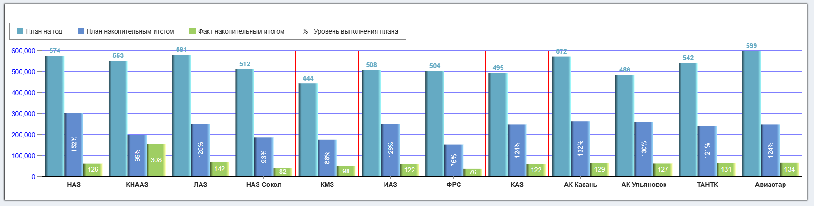

# LEGEND

Компонента, предназначенная для отрисовки легенды графика

````
<Legend
    fractions={[
        {text: 'План на год',                  color: '#65aac3'},
        {text: 'План накопительным итогом',    color: '#628ccf'},
        {text: 'Факт накопительным итогом',    color: '#9fce63'},
        {text: '% - Уровень выполнения плана'},
    ]}
    nameКey="text"
    colorKey="color"
    className="my-legend"
/>
````



| Параметр      | Назначение                                                                                                            |
|---------------|-----------------------------------------------------------------------------------------------------------------------|
| **fractions** | массив данных, на основе которого строится легенда                                                                    |
| **nameКey**   | ключ поля элемента **fractions**, в котором лежит текст элемента легенды                                              |
| **colorKey**  | ключ поля элемента **fractions**, в котором лежит цвет метки элемента легенды. Если цвета нет, метка не отображается  |
| **className** | дополнительный кастомный класс                                                                                        |
