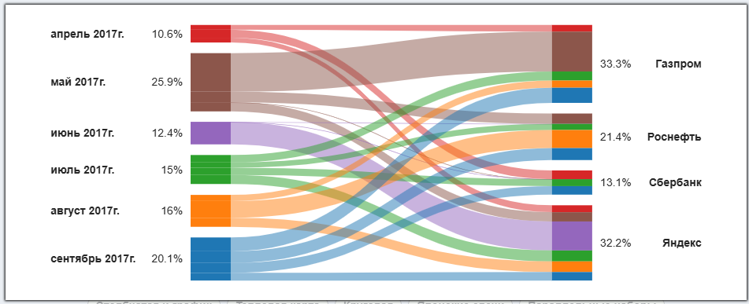
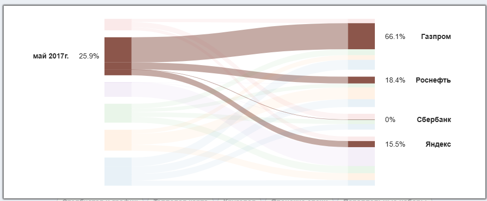
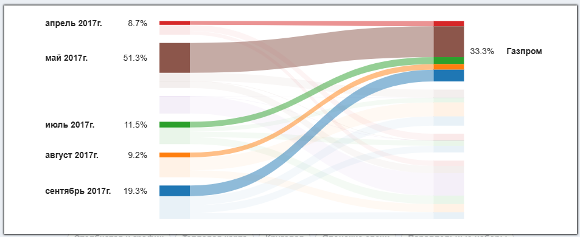

# PARALLEL SETS
Компонента позволяет
визуализировать распределение одного
свойства показателя в зависимости от другого свойства

````
const PARALLEL = () => {

    const fractions = [
        {year: 'апрель 2017г.',   color: '#d62728', values: [ 345,    0, 567,  354]},
        {year: 'май 2017г.',      color: '#8c564b', values: [2036,  567,   1,  478]},
        {year: 'июнь 2017г.',     color: '#9467bd', values: [  0,     1,   1, 1476]},
        {year: 'июль 2017г.',     color: '#2ca02c', values: [ 456,  333, 444,  555]},
        {year: 'август 2017г.',   color: '#ff7f0e', values: [ 365, 1000,   0,  543]},
        {year: 'сентябрь 2017г.', color: '#1f77b4', values: [ 765,  654, 543,  432]},
    ];

    return (
        <div className="parallel-test">
            <Chart fractions={fractions}>
                <ParallelSets
                    rightItems={['Газпром', 'Роснефть', 'Сбербанк', 'Яндекс']}
                    leftItemsKey="year"
                    dataKey="values"
                    colorKey="color"
                    verticalMarginPercent={2}
                    rectWidthPercent={10}
                    minHeightPercent={.2}
                />
            </Chart>
        </div>
    )
}
````


## Параметры

## fractions
Аналогично [BarDiagram](../../BarDiagram/doc/bardiagram.md#fractions)

Этот параметр может быть передан в обёртку **Chart** (если она используется)
или напрямую в **ParallelSets** (если не используется)

## rightItems
Массив с метками правой колонки графика. Размер массива должен совпадать
с размером массива **values** в **fractions**

## leftItemsKey
Ключ элемента массива **fractions**, по которому лежат метки левой колонки
графика

## dataKey
Ключ элемента массива **fractions**, по которому лежат значения, соответствующие
очередному элементу левой колонки и элементам правкой колонки графика

## colorKey
Ключ элемента массива **fractions**, по которому лежат цвета элементов левой колонки графика

## verticalMarginPercent
Значение зазора между элементами колонок, выраженное в процентах от общей высоты графика

## rectWidthPercent
Значение ширины графической части колонок (прямоугольников),
выраженное в процентах от общей ширины графика

## minHeightPercent
В случае, если какой-то элемент принимает настолько малое значение, что его графическое
изображение становится невидимым, можно использовать этот параметр

Минимальная высота графической части колонок (прямоугольников) и соединяющих
хорд, выраженная в процентах от общей высоты графика

# Интерактивность

При клике на графическую часть колонок (прямоугольников) графика слева,
которая относится к определенному периоду, на графике
отображается показатель в разрезе компаний за выбранный период



При клике на графическую часть колонок (прямоугольников) графика
справа, показатель отображается в разрезе периодов для выбранной компании



При повторном клике на тот-же элемент, отображается полный график