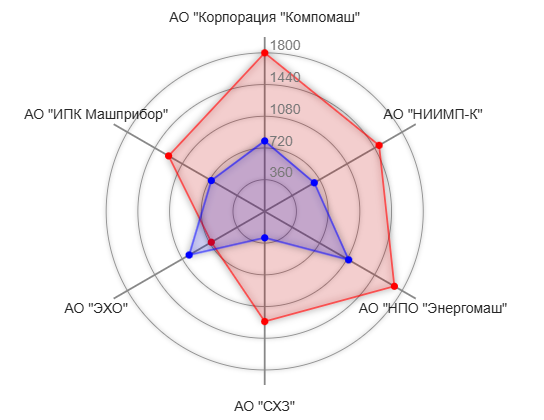

# RADAR

Компонента, которая строит чарт типа **радар**



````
const fractions = [
    {org: 'AO "Корпорация "Компомаш"',  value1: 1800, value2:  800},
    {org: 'AO "НИИМП-К"',               value1: 1500, value2:  650},
    {org: 'АО "НПО "Энергомаш"',        value1: 1700, value2: 1100},
    {org: 'АО "СХЗ"',                   value1: 1250, value2:  300},
    {org: 'АО "ЭХО"',                   value1:  700, value2:  990},
    {org: 'АО "ИПК Машприбор"',         value1: 1260, value2:  700},
];

return (
    <div className="bar-root radar-test">
        <Chart fractions={fractions}>
            <Radar
                labelKey="org"
                indicators={[
                    {valueKey: 'value1', color: '#f00'},
                    {valueKey: 'value2', color: '#00f'},
                ]}
                maxValue={1800}
                valueStep={300}
           />
        </Chart>
    </div>
)
````
## Параметры

## fractions
Основной массив данных, на основе которого строится чарт

Аналогично [BarDiagram](../../BarDiagram/doc/bardiagram.md#fractions)

### labelKey
Ключ элемента массива **fractions**, по которому лежит название элемента

### indicators

Массив, описывающий графики чарта. Каждый элемент массива - отдельный график, где
**valueKey** - ключ элемента массива **fractions**, по которому лежат значения
графика и **color** - цвет графика

### maxValue
Максимальное значение графика. Если не указан, то вычисляется автоматически

### valueStep
Шаг - разница между значениями сетки графика. Если не указан, то вычисляется автоматически
