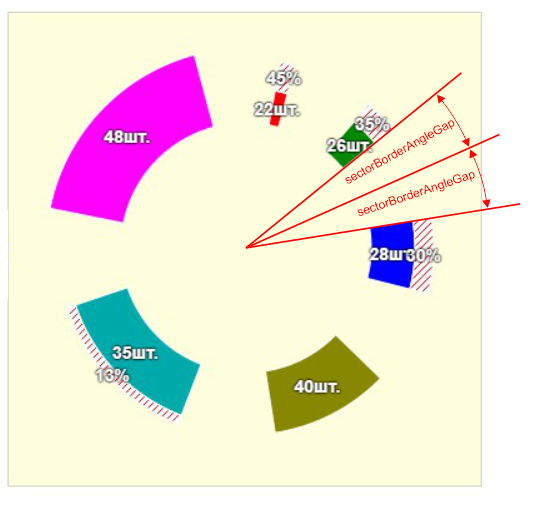
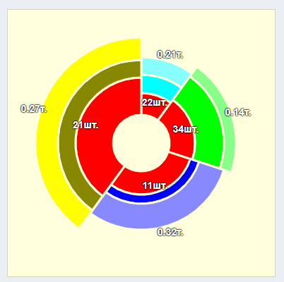

# RING DIAGRAM

Компонента отрисовки круговой диаграмы

````
<RingDiagram {...ringDiagramProps} />
````

## Дочерние компоненты

````
<RingDiagram {...ringDiagramProps} >
    <RingDiagramBackground {...backgroundProps} />
    <RingDiagramWheel {...whellProps} />
    <RingDiagramCircle {...circleProps} />
    <RingDiagramSectorText {...textProps} />
</RingDiagram>
````

| Компонента                                      | Назначение                                                                                                       |
|-------------------------------------------------|------------------------------------------------------------------------------------------------------------------|
| [RingDiagram](#ringdiagram)                     | Обёртка диаграммы. В качестве параметров на входе передаются данные, которые используются дочерними компонентами |
| [RingDiagramBackground](#ringdiagrambackground) | Отрисовка заднего плана диаграммы                                                                                |
| [RingDiagramWheel](#ringdiagramwheel)           | Отрисовка собственно самой диаграммы                                                                             |
| [RingDiagramCircle](#ringdiagramcircle)         | Отрисовка круга на диаграмме                                                                                     |
| [RingDiagramSectorText](#ringdiagramsectortext) | Отрисовка на диаграмме дополнительного текста                                                                    |


## RingDiagram

````
<RingDiagram {...ringDiagramProps} />
````

````
ringDiagramProps: {
    id: 'ringDiagramID',
    fractions = [],
    chartControllingRef = {current: {}},
    diagramSize: 200,
    outerRadius: 140,
    innerRadius: 40,
    sectorBorderColor: '#fff',
    sectorBorderWidth: 3,
    sectorBorderAngleGap: 1,
    rotate: '-90',
    style: {...},
}
````
### id
Уникальный идентификатор диаграмы.

Используется в ответах на события в диаграмме для
обеспечения понимания, от какой именно диаграмы пришло событие в случае
использования сразу нескольких диаграм одновременно

### fractions

Массив данных, на основе которого строится диаграмма.

````
fractions = [obj1, obj2, ... objN];
````

Содержимое каждого объекта массива fractions никак не регламентируется

Никаких полей с обязательными ключами
не предусмотрено. Настройка какие именно данные должны отображаться 
на диаграмме производится в другом месте, где задаются имена ключей 
необходимых полей (см.компоненту **RingDiagramWheel**)

### chartControllingRef

Объект, который при инициализации (как правило через **React.useRef**) имеет
структуру

````
chartControllingRef = {current: {}},
````

В **chartControllingRef.current** разные уровни компоненты будут складывать
методы, позволяющие управлять диаграммой извне (например, функцию
поворота диаграммы на заданный градус)

### diagramSize

Размер диаграммы. Диаграмма всегда квадратная, поэтому достаточно только одного измерения.
Значение задаётся в пикселях

Диаграмма всегда отрисовывается по центру квадрата размером **diagramSize** Х **diagramSize**

### outerRadius

Размер в пикселях внешнего радиуса диаграммы

### innerRadius

Размер в пикселях внутреннего радиуса диаграммы


### sectorBorderColor

Каждый сектор может иметь свой бордер. sectorBorderColor определяет его цвет

### sectorBorderWidth

sectorBorderWidth задаёт толщину бордера в пикселях

### sectorBorderAngleGap

Задаёт отклонение начального и конечного углов сектора в градусах



### rotate

Угол начального поворота диаграммы в градусах

### style

Дополнительные кастомные стили для диаграммы

[В начало RingDiagram](#ringdiagram)

[В начало документа](#ring-diagram)

## RingDiagramBackground

Эта компонента отрисовывает на квадрат размером в **diagramSize** (параметр из **RingDiagram**)

````
<RingDiagramBackground {...backgroundProps} />
````

backgroundProps:
````
{
    stroke: '#f00',
    strokeWidth: 2,
    fill: '#fff',
    className: 'abc',
    style: {...}

}
````

### stroke

Цвет бордера квадрата

### strokeWidth

Толщина бордера в пикселях

### fill

Цвет заливки квадрата

### className

Дополнительные кастомные классы обёртки квадрата

### style

Дополнительные кастомные CSS-свойства обёртки квадрата


[В начало RingDiagramBackground](#ringdiagrambackground)

[В начало документа](#ring-diagram)

## RingDiagramWheel

Компонента, которая отрисовывает собственно саму кольцевую диаграмму


````
<RingDiagramWheel {...wheelProps} />
````

wheelProps:
````
{
    onClickToSector = () => {},
    toCalculateAnglesKey: 'value',
    maximumValue: 100,
    sectorParts: [sectorPart1, sectorPart2, ...],
}
````

### onClickToSector

Колбэк, который будет вызываться при клике на сектор диаграммы

### toCalculateAnglesKey

Кольцо диаграммы делится на сектора в зависимости от входных данных. Чтобы понять,
какой сектор имеет какой угол, необходимо иметь набор неких значений, каждое из которых
и определяет угол в зависимости от величины. Чем больше значение, тем больше угол

Где взять эти значения? Параметр **toCalculateAnglesKey** как раз и говорит где их взять

На входе **<RingDiagram />** есть такой параметр как **fractions**. Это массив объектов,
имеющих какие-то данные. Допустим **fractions** имеет такой вид:

````
fractions = [
        {value: 1, color1: '#0ff', color2: '#8ff', aaa: 26, bbb: 22, ccc: 21, city: 'Омск'},
        {value: 2, color1: '#0f0', color2: '#8f8', aaa: 31, bbb: 34, ccc: 14, city: 'Питер'},
        {value: 3, color1: '#00f', color2: '#88f', aaa: 28, bbb: 11, ccc: 32, city: 'Томск'},
        {value: 4, color1: '#880', color2: '#ff0', aaa: 45, bbb: 21, ccc: 27, city: 'Сочи'},
]
````

Во-первых, размерность массива **fractions** определяет количество секторов, на 
которые будет разбито кольцо (их 4)

Во-вторых, чтобы вычислить какой угол будет иметь каждый сектор, необходимо
сообщить компоненте, какой параметр за это отвечет. Допустим, за этот параметр отвечает
поле "value" в каждом объекте **fractions**

В этом случае мы говорим, что параметр **toCalculateAnglesKey** равен "**sector**"

````
toCalculateAnglesKey: 'value',
````

Компонента находит сумму всех значений поля "value" и принимает эту сумму
за 360 градусов (полный оборот кольца). Тем самым каждое значение задаст
процентное отношение (угол) для каждого сектора в отдельности

### maximumValue

Как строятся сектора рассмотрим чуть ниже, а пока предположим что мы подсунули
компоненте данные, которые разбивают кольцо на некие сектора, каждый из которых имеет свой
угол и величину (разницу между внешним и внутренним радиусами)


Но вычесленные размеры это всего лишь пропорции. А как эти пропорции
превратить в реальные размеры в пикселях
на картине?

За это отвечает параметр **maximumValue**

У кольцевой диаграммы есть внутренний и внешний радиусы. Их разница составляет
100 относительных процентов. В абсолютных цифрах это расстояние соответствует
значению, установленному в **maximumValue**. Если же **maximumValue** не указан,
то это значение выбирается максимальным из вычисленных сумм размеров секторов.

Допустим мы наши сектора имеют относительные пропорции 26, 31, 28, 45 (по часовой стрелке
начиная с самого верхнего сектора)

Для наглядности нарисуем на картинке две окружности радиусами 150 и 40 пикселей. Это внутренний и
внешний радиусы нашей диаграммы

````
ringDiagramProps: {
    ...
    diagramSize: 150,
    outerRadius: 40,
    ...
}
````


Так вот, если мы не будем указывать **maximumValue**, то ко внешнему радиусу будет приравнено
максивальное значение из размеров секторов
````
max(26, 31, 28, 45) = 45
````
и в этом случае диаграмма быдкт "вписана" в область между внешним и внутренним радиусами


то есть 100% диаргаммы (а это внешний радиус) будет приравнен к максимальом сектору

Если-же мы укажем максимальное значение, например = 35, то за 100% диаграммы будет принято именно
это значение. Таким образом сектор размером 45 будет
выходить за пределы максимума, а остальные будут меньше его


[В начало RingDiagramWheel](#ringdiagramwheel)

[В начало документа](#ring-diagram)

### sectorParts

С секторами разобрались. Теперь давайте разберёмся что внутри каждого сектора


Как видно из картинки, каждый сектор может быть разбит на несколько частей (parts)

К примеру, мы хотим наглядно показать распределение возрастных групп в разных странах.
Кольцо - мир, сектор - население страны (начеление у всех стран
разное поэтому углы секторов разные). Каждая часть сектора - какая-то возростная группа. 
Отсюда и деление сектора на части

Параметр **sectorParts** определяет на сколько именно частей будет делиться кадый  сектор
и где брать данные о размере этих частей

Структура **sectorParts**:

````
sectorParts: [sectorPart1, sectorPart2,... sectorPartN];
````
Структура **sectorPart**:

````
sectorPart: {
            valueKey: 'realValue',
            colorKey: 'color',
            format: '#{realValue}шт.',
            offsetPercent: 50,
            offsetNumber: 0,
            className: 'abc',
            style: {...},
            sectorStyle: {...},
}
````
#### valueKey

По аналогии с **toCalculateAnglesKey** - ключ в каждом объекте массива **fractions**
по которому находятся данные для вычисления размера каждой части (part) сектора.

#### colorKey

По аналогии с **toCalculateAnglesKey** - ключ в каждом объекте массива **fractions**
по которому находятся данные о цвете каждой части (part) сектора.

Допустим, что у нас вот такой массив **fractions**:

````
fractions = [
    {value: 1, color1: '#0ff', color2: '#8ff', aaa: 26, bbb: 22, ccc: 21, city: 'Омск'},
    {value: 2, color1: '#0f0', color2: '#8f8', aaa: 31, bbb: 34, ccc: 14, city: 'Питер'},
    {value: 3, color1: '#00f', color2: '#88f', aaa: 28, bbb: 11, ccc: 32, city: 'Томск'},
    {value: 4, color1: '#880', color2: '#ff0', aaa: 45, bbb: 21, ccc: 27, city: 'Сочи'},
]
````
И строим вот такой **sectorParts**:
````
sectorParts: [
    {valueKey: 'aaa', colorKey: '#f00'  },
    {valueKey: 'bbb', colorKey: 'color1'},
    {valueKey: 'ccc', colorKey: 'color2'},
]
````
Что мы сказале компоненте?

- каждый сектор будет разбит на три части (по количеству элементов в **sectorParts**)


- первая (внутренняя часть) у каждого **i**-го сектора будет
иметь цвет '**#f00**' и относительный размер **fractions[i].aaa**


- средняя часть у каждого **i**-го сектора будет
иметь цвет **fractions[i].color1** и относительный размер **fractions[i].bbb**


- внешняя часть у каждого **i**-го сектора будет
иметь цвет **fractions[i].color2** и относительный размер **fractions[i].ссс**

Таким образом суммарный размер каждого сектора будет складываться из размеров его частей


````    
    1 сектор: fractions[0].aaa + fractions[0].bbb + fractions[0].ccc = 26 + 22 + 21 = 69
    2 сектор: fractions[1].aaa + fractions[1].bbb + fractions[1].ccc = 31 + 34 + 14 = 79
    3 сектор: fractions[2].aaa + fractions[2].bbb + fractions[2].ccc = 28 + 11 + 32 = 71
    4 сектор: fractions[3].aaa + fractions[3].bbb + fractions[3].ccc = 45 + 21 + 27 = 93
````


#### format

Каждая часть сектора может иметь поясняющий текст. Как правило это значение, которому оно
соответствует. Но бывают случаи, когда текст надо изменить или дополнить

Например в таблице у вас хранятся значения в процентах, вы отрисовываете
соответствующие им части секторов и вам необходим в поясняющем тексте добавить
знак процента

Для такого форматирования используется параметр **format**

````
format: "text#{key}text"
````

Правило "сборки" итоговой строки простое. Конструкция "#{key}" в строке подменяется
значением, которое лежит во **fractions[i]** по адресу "key". Причём key может
иметь конструкцию "key1.key2...keyN"

````
sectorParts: [
    {value: {a: 10, b: 20}, aaa: 22, format: '#{value.a}%'        }, // "10%"
    {value: {a: 30, b: 40}, aaa: 33, format: '#{value.b},000 руб.'}, // "40.000 руб."
    {value: {a: 50, b: 60}, aaa: 44, format: '#0.{aaa}%'          }, // "0.44%"
]
````


#### offsetPercent, offsetNumber

Эти два параметра определяют позицию поясняющего текста над частью сектора

Текст лежит всегда на прямой, лежащей посередине между начальным и конечным углами
сектора. Но на каком удалении относительно внутреннего радиуса сектора?

Это удаление задаётся этими двумя параметрами

**offsetPercent** - относительное удаление. Если = 0 - то это внутренний радиус,
если = 100 - это внешний радиус, 50 (по умолчанию) - ровно посередине между внутренним и внешним
(по центру сектора)

**offsetNumber** - абсолютная прибавка в пикселях (по умолчанию = 0)

````
{offsetPercent:   0, offsetNumber:   0} // на внутреннем радиусе
{offsetPercent: 100, offsetNumber:   0} // на внешнем радиусе
{offsetPercent:  50, offsetNumber:   0} // между внутренним и внешним радиусами
{offsetPercent: 100, offsetNumber:  20} // 20 пикселей дальше внешнего радиуса
{offsetPercent:   0, offsetNumber: -20} // 20 пикселей перед внутренним радиусом

ПРИМЕР:

sectorParts: [
    {..., format: '',                                                },
    {..., format: '#{bbb}шт.',  offsetPercent:   0, offsetNumber: -10},
    {..., format: '0.#{ccc}т.', offsetPercent: 100, offsetNumber:  10},
],
````



#### className

Дополнительный кастомный класс для соответствующей части сектора

#### style, sectorStyle

Дополнительные CSS-свойства для поясняющего текста части сектора и самой
части сектора соответственно

Что важно, так это то, что если в свойствах CSS встретится текст "**[COLOR]**", то он
автоматически заменится на цвет сектора

````
style: {
    color: '[COLOR]',
    background: '#fff',
    boxShadow: '0px 0px 0px 1px [COLOR]',
}
````

[В начало sectorParts](#sectorparts)

[В начало RingDiagramWheel](#ringdiagramwheel)

[В начало документа](#ring-diagram)


## RingDiagramCircle

Ну, тут всё просто. Отрисовываем окружность или круг на полотне диаграммы

````
<RingDiagramCircle radius="innerRadius" stroke="#888" strokeWidth={1} fill="none" />
````

Значение radius может иметь следующие значения:

- **Number** - величина в пикселях
- "**innerRadius**" - размер внутреннего радиуса диаграммы
- "**outerRadius**" - размер внешнего радиуса диаграммы

Но есть одна особенность. Если вместо параметра **radius** мы используем два других:
**innerRadius** и
**outerRadius**, то будет отрисовываться кольцо с этими радиусами:

````
<RingDiagramCircle
    innerRadius="innerRadius"
    outerRadius="outerRadius"
    stroke="#888"
    strokeWidth={1}
    fill="#ff0"
/>
````

**ВАЖНО!**

Допустимо использование только **radius** или только (**innerRadius** и
**outerRadius**). При любой другой комбинации этих параметров
ничего отрисовываться не будет


[В начало документа](#ring-diagram)

## RingDiagramSectorText

До сих пор мы имели возможность выводить текст для каждой части сектора через параметр **format** в
**sectorParts**

Но если нам необходимо вывести еще какие-то данные на диаграмме для каждого сектора,
есть такая возможность при помощи компоненты **RingDiagramSectorText**

````
const fractions = [
    {..., city: 'Омск',  color: '#0ff'},
    {..., city: 'Питер', color: '#0f0'},
    {..., city: 'Томск', color: '#f0f'},
    {..., city: 'Сочи',  color: '#ff0'},
]
````
Допусти мы хотим подписать каждый сектор имене города, к которому он относится
````
<RingDiagramSectorText {...textProps} />
````

Параметры:
````
textProps = {
        offsetPercent: 100,
        offsetNumber: 40,
        area: 'max',
        format: 'г.#{city}',
        colorKey: 'color',
        className: 'value-text',
        style: {
            background: '[COLOR]',
            color: '#fff',
            fontWeight: 'bold',
            boxShadow: '0px 0px 0px 1px #888'
        },
    }
````

### offsetPercent, offsetNumber

Аналогично offsetPercent и offsetNumber, описаному ранее, с той разницей, что смещение
текста высчитывается относительно выбранной области

### area

Область, относительно которой расчитывается смещение текста. Варианты:

- "real" - между внутренним и внешним радиусом сектора
- "max" - между внутренним радиусом диаграммы и максимумом между
внешним радиусом последней части сектора и внешним радиусом диаграммы
- "full" - между внутренним радиусом диаграммы и радиусом окружности, вписанной в background диаграммы


### format

Формат выводимого текста где в конструкции #{...} обозначен ключ поля из **fractions**

### colorKey

Ключ поля из **fractions**, в котором находится код цвета.

### className

Дополнительные кастомные классы обёртки текста

### style

Дополнительные кастомные CSS-свойства текста, где контекст "[COLOR]" подменяется текущим значением
цвета для данного сектора


[В начало RingDiagramSectorText](#ringdiagramsectortext)

[В начало документа](#ring-diagram)
