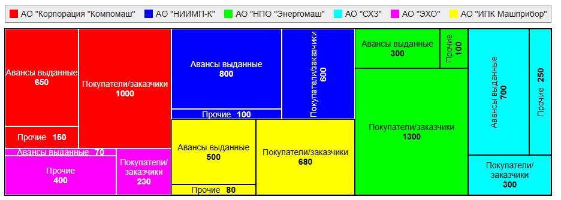
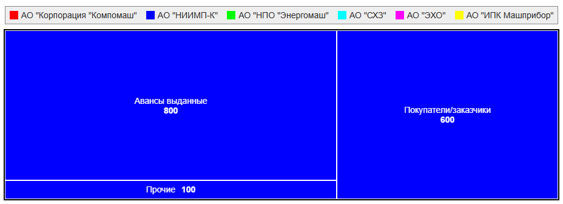

# TREEMAP

Компонента, которая строит чарт типа **карта дерева**



````
const a = 'Авансы выданные';
const b = 'Покупатели/заказчики';
const c = 'Прочие';

const fractions = [
    {org: 'AO "Корпорация "Компомаш"', color: '#f00', arr: [{label: a, value: 650}, {label: b, value: 1000}, {label: c, value: 150}]},
    {org: 'AO "НИИМП-К"',              color: '#00f', arr: [{label: a, value: 800}, {label: b, value:  600}, {label: c, value: 100}]},
    {org: 'АО "НПО "Энергомаш"',       color: '#0f0', arr: [{label: a, value: 300}, {label: b, value: 1300}, {label: c, value: 100}]},
    {org: 'АО "СХЗ"',                  color: '#0ff', arr: [{label: a, value: 700}, {label: b, value:  300}, {label: c, value: 250}]},
    {org: 'АО "ЭХО"',                  color: '#f0f', arr: [{label: a, value:  70}, {label: b, value:  230}, {label: c, value: 400}]},
    {org: 'АО "ИПК Машприбор"',        color: '#ff0', arr: [{label: a, value: 500}, {label: b, value:  680}, {label: c, value:  80}]},
];

return (
    <div className="bar-root tree-map-test">
        <Chart fractions={fractions}>
            <Legend nameКey="org" colorKey="color" />
            <TreeMap
                labelKey="org"
                colorKey="color"
                itemsKey="arr"
                itemLabelKey="label"
                itemValueKey="value"
                autoColor={true}
                className="aaa bbb"
                showValues={true}
            />
        </Chart>
    </div>
    )
````

## Параметры

## fractions
Основной массив данных, на основе которого строится чарт

Аналогично [BarDiagram](../../BarDiagram/doc/bardiagram.md#fractions)

## labelKey
Ключ элемента массива **fractions**, по которому лежит имя элемента

## colorKey
Ключ элемента массива **fractions**, по которому лежит цвет элемента

## itemsKey
Ключ элемента массива **fractions**, по которому лежит массив значений

## itemLabelKey
Ключ элемента массива значений, по которому лежит имя значения

## itemValueKey
Ключ элемента массива значений, по которому лежит величина значения

## autoColor
Флаг автоматического выбора цвета текста
и бордера (чёрный или белый) в зависимости от яркости
цвета фона (colorKey). Если выключен, то цвет чёрный для всх элементов

## className
Дополнительные кастомные классы чарта

## showValues
Флаг вывода не только наименовний элементов, но и значений



При клике по одному из элементов карты происходит разворачивание
этого элемента на всё поле. При повторном клике - сворачивание назад


