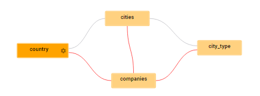
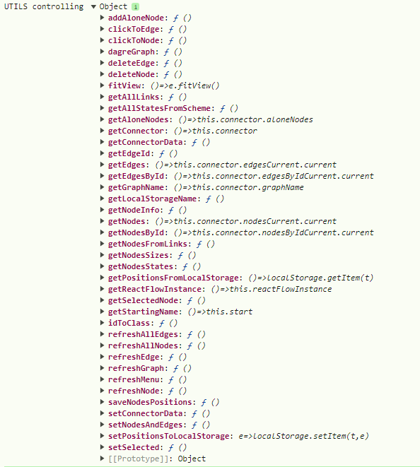

# ЗАПУСК

####
<Graph {...graphProps} />
####

# ПАРАМЕТРЫ

> graphProps = {\
&emsp;    [graphName](GRAPH.md#graphname): "text",\
&emsp;    [states](GRAPH.md#states): [...],\
&emsp;    [links](GRAPH.md#links): [...],\
&emsp;    [getComponentControlling](GRAPH.md#getcomponentcontrolling): () => {},\
&emsp;    [onChangeComponentState](GRAPH.md#onchangecomponentstate): {...},\
&emsp;    [options](GRAPH.md#options): {...},\
}


## graphName
Уникальное имя графа. Необходимо для сохранения настроек графа пользователем в **localeStorage**

## states
Array с описанием всех [узлов](thesaurus.md#узел-графа) графа.

````
states: [
    {label: 'country',   ...others...},
    {label: 'cities',    ...others...},
    {label: 'cpmpanies', ...others...},
    {label: 'city_type', ...others...},
]
````
### label
Обязательный параметр. Имя [узла](thesaurus.md#узел-графа), 
которое может выводится непосредственно на графе


<span style="display: flex; justify-content: center; align-items: center; width: 20px; height: 15px; color: white; font-size: 30px; background: blue; background: red; padding: 10px; 0; background-position: center; padding-bottom: 15px">⚠</span>
<span style="font-size: 16px; font-weight: bold;">
Используется как **ID** узла в графе, поэтому все **label** должны быть уникальными!
</span>
&emsp;\
&emsp;




### others
В данные по [узлам](thesaurus.md#узел-графа) можно 
добавлять абсолютно любую информацию, которая может понадобиться
вызывающему граф коду при обработке каких-то событий. Эти данные не используются
компонентой и возвращаются неизменными во всех коллбэках

## links
Array с описанием [связей](thesaurus.md#связь-графа) между [узлами](thesaurus.md#узел-графа)

````
links: [
    {from: 'country',   to: 'cities',    value: 'text1', ...others...},
    {from: 'country',   to: 'cpmpanies', value: 'text2', ...others...},
    {from: 'cities',    to: 'cpmpanies', value: 'text3', ...others...},
    {from: 'city_type', to: 'cities',    value: 'text4', ...others...},
    {from: 'city_type', to: 'cpmpanies', value: 'text5', ...others...},
]
````
### from
Обязательный. **ID** (label) исходящего [узла](thesaurus.md#узел-графа) [связи](thesaurus.md#связь-графа)
### to
Обязательный. **ID** (label) входящего [узла](thesaurus.md#узел-графа) [связи](thesaurus.md#связь-графа)
### value
Обязательный. Текст, который (возможно) будет выводиться поверх связи на графе
### others
В данные по [связям](thesaurus.md#связь-графа) можно добавлять
любую информацию, которая может понадобиться
вызывающему граф коду при обработке каких-то событий. Эти данные не используются
компонентой и возвращаются неизменными во всех коллбэках

## getComponentControlling
Эта функция, котороую вызовет компонента после её первоначальной отрисовки,
и в которую (в параметре) положит объект с набором функций, позволяющих управлять поведением
графа извне
````
const getComponentControlling = data => {
    console.log('UTILS controlling', data)
}
````


Подробно о функциях контроллинга графа смотри в **[controlling](controlling.md)**

## onChangeComponentState
Набор обработчиков событий, происходящих в графе
````
onChangeComponentState: {
    onNodeSelect:          () => {},
    onGraphElementsDelete: () => {},
    onNodeAdd:             () => {},
    onNodeRename:          () => {},
    onLinkSelect:          () => {},
    onLinkReverse:         () => {},
    onLinkAdd:             () => {},
    onLinkAndNodeAdd:      () => {},
    onDropNode:            () => {},
}
````

Подробнее см. в **[events](events.md)**


## options
Параметры настройки внешнего вида и поведения графа. 
Описание смотри в **[options](options.md)**
>
&emsp;\
&emsp;\
&emsp;\
&emsp;\
&emsp;\
&emsp;\
&emsp;\
&emsp;\
&emsp;\
&emsp;\
&emsp;\
&emsp;\
&emsp;\
&emsp;\
&emsp;\
&emsp;\
&emsp;\
&emsp;\
&emsp;\
&emsp;\
&emsp;\
&emsp;\
&emsp;\
&emsp;\
&emsp;\
&emsp;\
&emsp;\
&emsp;\
&emsp;\
&emsp;\
&emsp;\
&emsp;\
&emsp;\
&emsp;\
&emsp;\
&emsp;\
&emsp;\
&emsp;\
&emsp;\
&emsp;\
&emsp;\
&emsp;\
&emsp;\
&emsp;\
&emsp;\
&emsp;\
&emsp;\
&emsp;\
&emsp;\
&emsp;\
&emsp;\
&emsp;\
&emsp;

