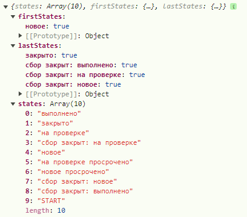
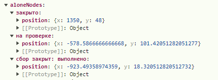
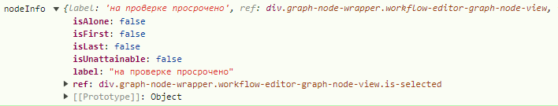
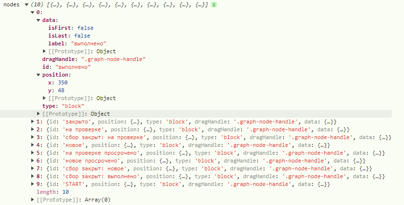
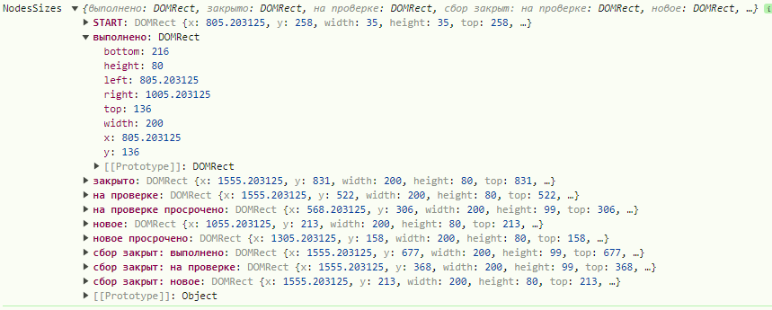
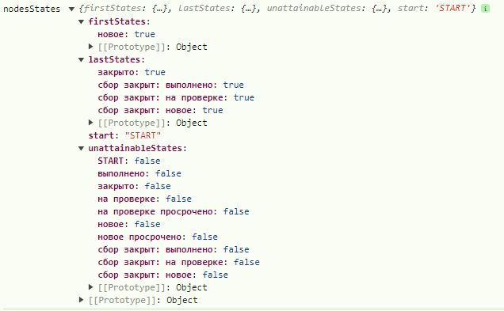
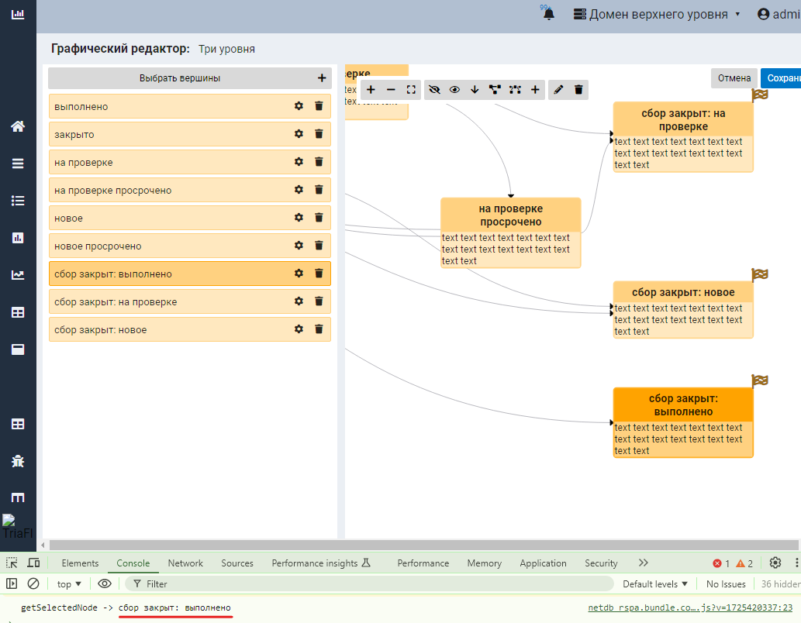

# CONTROLLING

[getComponentControlling](GRAPH.md#getcomponentcontrolling) компоненты **Graph** 
возвращает набор методов, позволяющих не только
узнать состояние **графа**, но и управлять этим
состоянием

## Методы контроллинга

|Функция|Назначение|
|---|---|
|[addAloneNode](#addalonenode) | добавить новый [висячий](thesaurus.md#висячий-узел) [узел](thesaurus.md#узел-графа) в граф |
|[clickToEdge](#clicktoedge) | симитировать клик по [связи](thesaurus.md#связь-графа) |
|[clickToNode](#clicktonode) | симитировать клик по [узлу](thesaurus.md#узел-графа) |
|[dagreGraph](#dagregraph) | перестроить граф по DARGE-алгоритму |
|[deleteEdge](#deleteedge) | удалить [связь](thesaurus.md#связь-графа) |
|[deleteNode](#deletenode) | удалить [узел](thesaurus.md#узел-графа) |
|[fitView](#fitview) | разместить граф по центру и размерам окна |
|[getAllLinks](#getalllinks) | получить различные представления входного массива links |
|[getAllStatesFromScheme](#getallstatesfromscheme) | получить информацию о статусах [узлов](thesaurus.md#узел-графа) графа |
|[getAloneNodes](#getalonenodes) | получить информацию по всем [висячим узлам](thesaurus.md#висячий-узел)  |
|[getConnector](#getconnector) | получить ссылку на [коннектор](thesaurus.md#коннектор) |
|[getConnectorData](#getconnectordata) | Получить все [висячие узлы](thesaurus.md#висячий-узел)  и [связи](thesaurus.md#связь-графа) графа |
|[getEdgeId](#getedgeid) | Получить ID [связи](thesaurus.md#связь-графа) |
|[getEdges](#getedges) | Получить список [связей](thesaurus.md#связь-графа) |
|[getEdgesById](#getedgesbyid) | Получить [связь](thesaurus.md#связь-графа) на основе её ID |
|[getGraphName](#getgraphname) | Получить имя графа |
|[getLocalStorageName](#getlocalstoragename) | Получить имя в localeStorage для сохранения данных графа |
|[getNodeInfo](#getnodeinfo) | Получить информацию по [узлу](thesaurus.md#узел-графа) |
|[getNodes](#getnodes) | Получить список [узлов](thesaurus.md#узел-графа) |
|[getNodesById](#getnodesbyid) | Получить [узел](thesaurus.md#узел-графа) на основе его ID |
|[getNodesFromLinks](#getnodesfromlinks) | Получить данные об [узлах](thesaurus.md#узел-графа) из входного массива [связей](thesaurus.md#связь-графа) |
|[getNodesSizes](#getnodessizes) | Получить позиции и размеры всех [узлов](thesaurus.md#узел-графа) графа |
|[getNodesStates](#getnodesstates) | Получить статусы всех [узлов](thesaurus.md#узел-графа) графа |
|[getPositionsFromLocalStorage](#getpositionsfromlocalstorage) | Получить координаты [узлов](thesaurus.md#узел-графа) графа из localetorage |
|[getReactFlowInstance](#getreactflowinstance) | Получить [ReactFlowInstance](thesaurus.md#reactflowinstance) графа |
|[getSelectedNode](#getselectednode) | Получить **label** выбранного [узла](thesaurus.md#узел-графа) графа |
|[getStartingName](#getstartingname) | Получить **label** [точки входа](thesaurus.md#точка-входа-в-граф) в граф |
|[idToClass](#idtoclass) | Преобразовать **ID** [узла](thesaurus.md#узел-графа) или [связи](thesaurus.md#связь-графа) в класс |
|[refreshAllEdges](#refreshalledges) | Обновить отображение всех [связей](thesaurus.md#связь-графа) графа |
|[refreshAllNodes](#refreshallnodes) | Обновить отображение всех [узлов](thesaurus.md#узел-графа) графа |
|[refreshEdge](#refreshedge) | Обновить отображение [связи](thesaurus.md#связь-графа) по её **ID** |
|[refreshGraph](#refreshgraph) | Обновить отображение всего графа |
|[refreshMenu](#refreshmenu) | Обновить отображение меню графа |
|[refreshNode](#refreshnode) | Обновить отображение [узла](thesaurus.md#узел-графа) по его **label** |
|[saveNodesPositions](#savenodespositions) | Сохранить координаты узлов в localeStorage |
|[setConnectorData](#setconnectordata) | Обновление данных графа |
|[setNodesAndEdges](#setnodesandedges) | Обновление данных по [узлам](thesaurus.md#узел-графа) и [связям](thesaurus.md#связь-графа) |
|[setPositionsToLocalStorage](#setpositionstolocalstorage) | Обновление в localeStorage данных о позициях [узлов](thesaurus.md#узел-графа) графа |
|[setSelected](#setselected) | Установить активный элемент графа |


## addAloneNode
Добавление нового [висячего узла](thesaurus.md#висячий-узел) 
в граф
````
addAloneNode({
            label: 'Новый узел',
            position: {
                x: 100,
                y: 100,
            },
        });
````
- **label** - имя [узла](thesaurus.md#узел-графа)
- **position** - координаты в окне

[В начало](#controlling)


## clickToEdge
Имитация пользовательского клика по [связи](thesaurus.md#связь-графа). В этом случае отработает весь функционал,
который отрабатывается при клике мышкой по [связи](thesaurus.md#связь-графа) пользователем.
````
clickToEdge(id);
````

- **id** - ID [узла](thesaurus.md#узел-графа)
[В начало](#controlling)


## clickToNode
Имитация пользовательского клика по [узлу](thesaurus.md#узел-графа). В этом случае отработает весь функционал,
который отрабатывается при клике мышкой по [узлу](thesaurus.md#узел-графа) пользователем.
````
clickToNode(id);
````

- **id** - ID [узла](thesaurus.md#узел-графа)
[В начало](#controlling)


## dagreGraph
Перестроить граф по DARGE-алгоритму. Эквивалентно клику пользователя на иконку
DARGE-распределения графа


[В начало](#controlling)


## deleteEdge
Удалить [связь](thesaurus.md#связь-графа) их графа с подтверждением или без


````
deleteEdge(id, withoutQuestion);
````
- **id** - ID [связи](thesaurus.md#связь-графа) (ребра) графа
- **withoutQuestion** - признак "тихого" удаления (без подтверждения)

[В начало](#controlling)


## deleteNode
Удалить [узел](thesaurus.md#узел-графа) их графа с подтверждением или без

````
deleteNode(id, withoutQuestion);
````
- **id** - ID [узла](thesaurus.md#узел-графа) графа
- **withoutQuestion** - признак "тихого" удаления (без подтверждения)

[В начало](#controlling)


## fitView
Разместить граф по центру окна так, чтобы он полностью входил в окно и занимал максимум
пространства
[В начало](#controlling)


## getAllLinks
Получить различные представления входного массива links.
Это объекты различной структуры данных, которые могут
быть полезны для ускорения (упрощения) поиска и обработки данных
````
const {linksById, linksByFrom, linksByTo, linksAllLabels} = getAllLinks();
````

|ОБЪЕКТ|КЛЮЧ|ЗНАЧЕНИЕ|
|---|---|---|
|**linksById** | ID [связей](thesaurus.md#связь-графа) |связь с этим ID|
|**linksByFrom** | значение поля "from"|Array [связей](thesaurus.md#связь-графа), у которых поле "from" равно ключу|
|**linksByTo** | значение поля "to"|Array [связей](thesaurus.md#связь-графа), у которых поле "to" равно ключу|
|**linksAllLabels** | значение поля "label"|true|

[В начало](#controlling)


## getAllStatesFromScheme
Получить информацию о статусах [узлов](thesaurus.md#узел-графа) графа
````
const {states, firstStates, lastStates} = getAllStatesFromScheme();
````
|ОБЪЕКТ|СОДЕРЖИМОЕ|
|---|---|
|**states** | Array значений "label" всех [узлов](thesaurus.md#узел-графа) графа |
|**firstStates** | объект, ключами которого являются label тех [узлов](thesaurus.md#узел-графа), на которые нет переходов (начальные узлы) |
|**lastStates** | объект, ключами которого являются label тех [узлов](thesaurus.md#узел-графа), из которых нет переходов (конечные узлы)|



[В начало](#controlling)


## getAloneNodes
Получить информацию по всем [висячим узлам](thesaurus.md#висячий-узел) 

````
const aloneNodes = getAloneNodes();
````



На выхлде получаем объект с ключами - именами [узлов](thesaurus.md#узел-графа) и для каждого
объектом **position** - позицией [узла](thesaurus.md#узел-графа) в окне

[В начало](#controlling)


## getConnector
Получить ссылку на [коннектор](thesaurus.md#коннектор)

Доступ к нему напрямую дан на случай, если вдруг у разработчика возникнет необходимость 
в действиях, не предусмотренных данным фукциональным набором.

На момент написания этого текста данный метод в системе не использовался


## getConnectorData
Получить все [висячие узлы](thesaurus.md#висячий-узел) и [связи](thesaurus.md#связь-графа) графа

````
const {links, aloneNodes} = getConnectorData();
````
Избыточный метод. Данную информацию можно получить другими методами

[В начало](#controlling)


## getEdgeId
Получить **ID** [связи](thesaurus.md#связь-графа) в графе на основе элемента из Array **links**

````
const id = getEdgeId(link)
````
Каждой [связи](thesaurus.md#связь-графа) графа присваивается свой **ID**. Правила генерации **ID** разные и зависят от:

- направленная это [связь](thesaurus.md#связь-графа) или ненаправленная
- допустимы или нет несколько [связей](thesaurus.md#связь-графа) между двумя [узлами](thesaurus.md#узел-графа)

[В начало](#controlling)


## getEdges
Получить список [связей](thesaurus.md#связь-графа)

````
const edges = getEdges();
````

[В начало](#controlling)


## getEdgesById
Получить [связь](thesaurus.md#связь-графа) на основе её **ID**
````
const link = getEdgesById(id);
````
[В начало](#controlling)


## getGraphName
Получить имя графа. Это то самое имя, которое задано
в параметре [graphName](GRAPH.md#graphname)
при вызове компоненты
````
const graphName = getGraphName();
````

[В начало](#controlling)


## getLocalStorageName
Получить имя в localeStorage для сохранения данных графа. Это имя
строится на основе параметра [graphName](GRAPH.md#graphname)

````
const localeStorageName = getLocalStorageName();
````
[В начало](#controlling)


## getNodeInfo
Получить информацию по [узлу](thesaurus.md#узел-графа)
````
console.log('nodeInfo', getNodeInfo(id))
````


|ПАРАМЕТР|ЗНАЧЕНИЕ|
|---|---|
| isAlone | [узел](thesaurus.md#узел-графа) является [висячим](thesaurus.md#висячий-узел) |
| isFirst | [узел](thesaurus.md#узел-графа) не имеет входящих [связей](thesaurus.md#связь-графа) |
| isLast | [узел](thesaurus.md#узел-графа) не имеет исходящих [связей](thesaurus.md#связь-графа) |
| isUnattainable | [узел](thesaurus.md#узел-графа) является [недостижимым](thesaurus.md#недостижимый-узел) |
| label | название [узла](thesaurus.md#узел-графа) |
| ref | ссыдка на [узел](thesaurus.md#узел-графа) в DOM-дереве|

[В начало](#controlling)


## getNodes
Получить список [узлов](thesaurus.md#узел-графа)

````
const nodes = getNodes();
````
[В начало](#controlling)


## getNodesById
Получить [узел](thesaurus.md#узел-графа) на основе его **ID**
````
const node = getNodesById(id);
````
[В начало](#controlling)


## getNodesFromLinks
Парсер. Вытаскивает данные об [узлах](thesaurus.md#узел-графа) из входного массива [связей](thesaurus.md#связь-графа)
````
const nodes = getNodesFromLinks();
console.log('nodes', nodes);
````

[В начало](#controlling)


## getNodesSizes
Получить позиции и размеры всех [узлов](thesaurus.md#узел-графа) графа

````
const nodesSizes = getNodesSizes();
console.log('NodesSizes', nodesSizes);
````

[В начало](#controlling)


## getNodesStates
Получить статусы всех [узлов](thesaurus.md#узел-графа) графа
````
const nodesStates = getNodesStates();
console.log('nodesStates', nodesStates);
````


|ОБЪЕКТ|СОДЕРЖИМОЕ|
|---|---|
|**start**| мнемоника (label) [точки входа](thesaurus.md#стартовый-псевдо-узел) в граф|
|**firstStates** | объект, ключами которого являются label тех [узлов](thesaurus.md#узел-графа), на которые нет переходов (начальные узлы) |
|**lastStates** | объект, ключами которого являются label тех [узлов](thesaurus.md#узел-графа), из которых нет переходов (конечные узлы)|
|**unattainableStates** | объект, ключами которого являются label 
тех [узлов](thesaurus.md#узел-графа),
которые являются [недостижимыми](thesaurus.md#недостижимый-узел)|
[В начало](#controlling)


## getPositionsFromLocalStorage
Получить координаты [узлов](thesaurus.md#узел-графа) графа из сохранённых в localetorage данных
````
const coords = getPositionsFromLocalStorage();
````
[В начало](#controlling)


## getReactFlowInstance
Получить [ReactFlowInstance](thesaurus.md#reactflowinstance) редактируемого окна графа
````
const ReactFlowInstance = getReactFlowInstance();
````
[В начало](#controlling)


## getSelectedNode
Получить **label** выбранного (акивного) [узла](thesaurus.md#узел-графа) графа
````
console.log('getSelectedNode ->', getSelectedNode())
````

[В начало](#controlling)


## getStartingName
Получить **label** [точки входа](thesaurus.md#точка-входа-в-граф) в граф
````
const startLabel = getStartingName();
````
[В начало](#controlling)


## idToClass
Преобразовать **ID** [узла](thesaurus.md#узел-графа) или [связи](thesaurus.md#связь-графа) в класс
````
const className = idToClass({prefix: 'node_', id: 'сбор закрыт'})
````
> результат: className === "**node_сбор_закрыт**"

[В начало](#controlling)


## refreshAllEdges
Обновить отображение всех [связей](thesaurus.md#связь-графа) графа
````
refreshAllEdges();
````
[В начало](#controlling)


## refreshAllNodes
Обновить отображение всех [узлов](thesaurus.md#узел-графа) графа
````
refreshAllNodes();
````
[В начало](#controlling)


## refreshEdge
Обновить отображение [связи](thesaurus.md#связь-графа) по её **ID**
````
refreshEdge(id);
````
[В начало](#controlling)


## refreshGraph
Обновить отображение всего графа
````
refreshGraph();
````
[В начало](#controlling)


## refreshMenu
Обновить отображение меню графа
````
refreshMenu();
````
[В начало](#controlling)


## refreshNode
Обновить отображение [узла](thesaurus.md#узел-графа) по его **label**
````
refreshNode(label);
````
[В начало](#controlling)


## saveNodesPositions
Сохранить координаты узлов в localeStorage
````
saveNodesPositions(nodes, newNodeCoords);
````
|ПАРАМЕТР|НАЗНАЧЕНИЕ|
|---|---|
|**nodes**|Не обязательный. Список узлов компоненты. Если отсутствует, то метод берёт **nodes** из [коннектора](thesaurus.md#коннектор)|
|**newNodeCoords**| Не обязательный. Координаты созданного [висячего узла](thesaurus.md#висячий-узел)  |

[В начало](#controlling)


## setConnectorData
Обновление данных графа
````
setConnectorData({links, aloneNodes})
````
Применяется, если во внешнем коде произошло изменение во входных данных, которое надо
актуализировать на графе
|ПАРАМЕТР|НАЗНАЧЕНИЕ|
|---|---|
|**links**| Новые данные по [связям](thesaurus.md#связь-графа) |
|**aloneNodes**| Новые данные по [висячим узлам](thesaurus.md#висячий-узел) |
[В начало](#controlling)


## setNodesAndEdges
Обновление данных по [узлам](thesaurus.md#узел-графа) и
[связям](thesaurus.md#связь-графа) на основании массива [links](GRAPH.md#links),
который берётся из [коннектора](thesaurus.md#коннектор)
````
setNodesAndEdges();
````
[В начало](#controlling)


## setPositionsToLocalStorage
Обновление в localeStorage данных о позициях [узлов](thesaurus.md#узел-графа) графа
````
setPositionsToLocalStorage(positions);
````
[В начало](#controlling)


## setSelected
Установить активный элемент графа

В любой мометн времени активным может быть либо какой-то
[узел](thesaurus.md#узел-графа) графа,
либо какая-то [связь](thesaurus.md#связь-графа)
````
setSelected(nodeId, edgeId)
````
|ПАРАМЕТР|НАЗНАЧЕНИЕ|
|---|---|
|**nodeId**| **ID** [узла](thesaurus.md#узел-графа) \|\| NULL |
|**edgeId**| **ID** [связи](thesaurus.md#связь-графа) \|\| NULL |
[В начало](#controlling)
>
&emsp;\
&emsp;\
&emsp;\
&emsp;\
&emsp;\
&emsp;\
&emsp;\
&emsp;\
&emsp;\
&emsp;\
&emsp;\
&emsp;\
&emsp;\
&emsp;\
&emsp;\
&emsp;\
&emsp;\
&emsp;\
&emsp;\
&emsp;\
&emsp;\
&emsp;\
&emsp;\
&emsp;\
&emsp;\
&emsp;\
&emsp;\
&emsp;\
&emsp;\
&emsp;\
&emsp;\
&emsp;\
&emsp;\
&emsp;\
&emsp;\
&emsp;\
&emsp;\
&emsp;\
&emsp;\
&emsp;\
&emsp;\
&emsp;\
&emsp;\
&emsp;\
&emsp;\
&emsp;\
&emsp;\
&emsp;\
&emsp;\
&emsp;\
&emsp;\
&emsp;\
&emsp;

