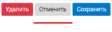

# OPTIONS

Структура [объекта опций](GRAPH.md#параметры) при построении таблицы


### <svg  viewBox="0 0 512 512" style="fill: white; width: 15px"><path d="M487.4 315.7l-42.6-24.6c4.3-23.2 4.3-47 0-70.2l42.6-24.6c4.9-2.8 7.1-8.6 5.5-14-11.1-35.6-30-67.8-54.7-94.6-3.8-4.1-10-5.1-14.8-2.3L380.8 110c-17.9-15.4-38.5-27.3-60.8-35.1V25.8c0-5.6-3.9-10.5-9.4-11.7-36.7-8.2-74.3-7.8-109.2 0-5.5 1.2-9.4 6.1-9.4 11.7V75c-22.2 7.9-42.8 19.8-60.8 35.1L88.7 85.5c-4.9-2.8-11-1.9-14.8 2.3-24.7 26.7-43.6 58.9-54.7 94.6-1.7 5.4 .6 11.2 5.5 14L67.3 221c-4.3 23.2-4.3 47 0 70.2l-42.6 24.6c-4.9 2.8-7.1 8.6-5.5 14 11.1 35.6 30 67.8 54.7 94.6 3.8 4.1 10 5.1 14.8 2.3l42.6-24.6c17.9 15.4 38.5 27.3 60.8 35.1v49.2c0 5.6 3.9 10.5 9.4 11.7 36.7 8.2 74.3 7.8 109.2 0 5.5-1.2 9.4-6.1 9.4-11.7v-49.2c22.2-7.9 42.8-19.8 60.8-35.1l42.6 24.6c4.9 2.8 11 1.9 14.8-2.3 24.7-26.7 43.6-58.9 54.7-94.6 1.5-5.5-.7-11.3-5.6-14.1zM256 336c-44.1 0-80-35.9-80-80s35.9-80 80-80 80 35.9 80 80-35.9 80-80 80z"/></svg>&emsp; ПАРАМЕТРЫ КАСТОМИЗАЦИИ
| ПАРАМЕТР &emsp;&emsp;&emsp;&emsp;&emsp;&emsp;&emsp;&emsp;&emsp;| ТИП &nbsp;&nbsp;&nbsp;&nbsp;| НАЗНАЧЕНИЕ|
|---|---|---|
|[graphView](#graphview) | Object | определение кастомного представления [элеметнов графа](thesaurus.md#элеметны-графа) |
### <svg  viewBox="0 0 512 512" style="fill: white; width: 15px"><path d="M487.4 315.7l-42.6-24.6c4.3-23.2 4.3-47 0-70.2l42.6-24.6c4.9-2.8 7.1-8.6 5.5-14-11.1-35.6-30-67.8-54.7-94.6-3.8-4.1-10-5.1-14.8-2.3L380.8 110c-17.9-15.4-38.5-27.3-60.8-35.1V25.8c0-5.6-3.9-10.5-9.4-11.7-36.7-8.2-74.3-7.8-109.2 0-5.5 1.2-9.4 6.1-9.4 11.7V75c-22.2 7.9-42.8 19.8-60.8 35.1L88.7 85.5c-4.9-2.8-11-1.9-14.8 2.3-24.7 26.7-43.6 58.9-54.7 94.6-1.7 5.4 .6 11.2 5.5 14L67.3 221c-4.3 23.2-4.3 47 0 70.2l-42.6 24.6c-4.9 2.8-7.1 8.6-5.5 14 11.1 35.6 30 67.8 54.7 94.6 3.8 4.1 10 5.1 14.8 2.3l42.6-24.6c17.9 15.4 38.5 27.3 60.8 35.1v49.2c0 5.6 3.9 10.5 9.4 11.7 36.7 8.2 74.3 7.8 109.2 0 5.5-1.2 9.4-6.1 9.4-11.7v-49.2c22.2-7.9 42.8-19.8 60.8-35.1l42.6 24.6c4.9 2.8 11 1.9 14.8-2.3 24.7-26.7 43.6-58.9 54.7-94.6 1.5-5.5-.7-11.3-5.6-14.1zM256 336c-44.1 0-80-35.9-80-80s35.9-80 80-80 80 35.9 80 80-35.9 80-80 80z"/></svg>&emsp; ПАРАМЕТРЫ ГРАФА
| ПАРАМЕТР &emsp;&emsp;&emsp;&emsp;&emsp;&emsp;&emsp;&emsp;&emsp;| ТИП &nbsp;&nbsp;&nbsp;&nbsp;| НАЗНАЧЕНИЕ|
|---|---|---|
|[startPositions](#startpositions) | String | задать начальные координаты [узлов](thesaurus.md#узел-графа) графа |
|[callbackOnGraphReady](#callbackongraphready) | Function |коллбэк после первого полного посроения компоненты в DOM-дереве
|[showNodeEnvironment](#shownodeenvironment) | String | показывать только часть графа, связанного с [узлом](thesaurus.md#узел-графа) с заданным **ID**
|[isDroppable](#isdroppable) | Bool | признак возможности дропать на поле графа новые [узлы](thesaurus.md#узел-графа) |
|[linksForStates](#linksforstates) | Array | еще один экземпляр [links](GRAPH.md#links) 
### <svg  viewBox="0 0 512 512" style="fill: white; width: 15px"><path d="M487.4 315.7l-42.6-24.6c4.3-23.2 4.3-47 0-70.2l42.6-24.6c4.9-2.8 7.1-8.6 5.5-14-11.1-35.6-30-67.8-54.7-94.6-3.8-4.1-10-5.1-14.8-2.3L380.8 110c-17.9-15.4-38.5-27.3-60.8-35.1V25.8c0-5.6-3.9-10.5-9.4-11.7-36.7-8.2-74.3-7.8-109.2 0-5.5 1.2-9.4 6.1-9.4 11.7V75c-22.2 7.9-42.8 19.8-60.8 35.1L88.7 85.5c-4.9-2.8-11-1.9-14.8 2.3-24.7 26.7-43.6 58.9-54.7 94.6-1.7 5.4 .6 11.2 5.5 14L67.3 221c-4.3 23.2-4.3 47 0 70.2l-42.6 24.6c-4.9 2.8-7.1 8.6-5.5 14 11.1 35.6 30 67.8 54.7 94.6 3.8 4.1 10 5.1 14.8 2.3l42.6-24.6c17.9 15.4 38.5 27.3 60.8 35.1v49.2c0 5.6 3.9 10.5 9.4 11.7 36.7 8.2 74.3 7.8 109.2 0 5.5-1.2 9.4-6.1 9.4-11.7v-49.2c22.2-7.9 42.8-19.8 60.8-35.1l42.6 24.6c4.9 2.8 11 1.9 14.8-2.3 24.7-26.7 43.6-58.9 54.7-94.6 1.5-5.5-.7-11.3-5.6-14.1zM256 336c-44.1 0-80-35.9-80-80s35.9-80 80-80 80 35.9 80 80-35.9 80-80 80z"/></svg>&emsp; ПАРАМЕТРЫ УЗЛОВ
| ПАРАМЕТР &emsp;&emsp;&emsp;&emsp;&emsp;&emsp;&emsp;&emsp;&emsp;| ТИП &nbsp;&nbsp;&nbsp;&nbsp;| НАЗНАЧЕНИЕ|
|---|---|---|
|[nodesNotDraggable](#nodesnotdraggable) | Bool | признак возможноси перемещения [узлов](thesaurus.md#узел-графа)|
|[showNodeStatus](#shownodestatus) | Object | признак анализа статусов [узлов](thesaurus.md#узел-графа)|
|[showNodesBodyInStart](#shownodesbodyinstart) | Bool | признак отображения [**Body** узлов](thesaurus.md#элеметны-графа) |
|[nodesNotConnectable](#nodesnotconnectable) | Bool | признак возможности созданния новых [связей](thesaurus.md#связь-графа) между [узлами](thesaurus.md#узел-графа) |
|[onClickToNode](#onclicktonode) | Function | обработчик события клика по [узлу](thesaurus.md#узел-графа) |
### <svg  viewBox="0 0 512 512" style="fill: white; width: 15px"><path d="M487.4 315.7l-42.6-24.6c4.3-23.2 4.3-47 0-70.2l42.6-24.6c4.9-2.8 7.1-8.6 5.5-14-11.1-35.6-30-67.8-54.7-94.6-3.8-4.1-10-5.1-14.8-2.3L380.8 110c-17.9-15.4-38.5-27.3-60.8-35.1V25.8c0-5.6-3.9-10.5-9.4-11.7-36.7-8.2-74.3-7.8-109.2 0-5.5 1.2-9.4 6.1-9.4 11.7V75c-22.2 7.9-42.8 19.8-60.8 35.1L88.7 85.5c-4.9-2.8-11-1.9-14.8 2.3-24.7 26.7-43.6 58.9-54.7 94.6-1.7 5.4 .6 11.2 5.5 14L67.3 221c-4.3 23.2-4.3 47 0 70.2l-42.6 24.6c-4.9 2.8-7.1 8.6-5.5 14 11.1 35.6 30 67.8 54.7 94.6 3.8 4.1 10 5.1 14.8 2.3l42.6-24.6c17.9 15.4 38.5 27.3 60.8 35.1v49.2c0 5.6 3.9 10.5 9.4 11.7 36.7 8.2 74.3 7.8 109.2 0 5.5-1.2 9.4-6.1 9.4-11.7v-49.2c22.2-7.9 42.8-19.8 60.8-35.1l42.6 24.6c4.9 2.8 11 1.9 14.8-2.3 24.7-26.7 43.6-58.9 54.7-94.6 1.5-5.5-.7-11.3-5.6-14.1zM256 336c-44.1 0-80-35.9-80-80s35.9-80 80-80 80 35.9 80 80-35.9 80-80 80z"/></svg>&emsp; ПАРАМЕТРЫ СВЯЗЕЙ
| ПАРАМЕТР &emsp;&emsp;&emsp;&emsp;&emsp;&emsp;&emsp;&emsp;&emsp;| ТИП &nbsp;&nbsp;&nbsp;&nbsp;| НАЗНАЧЕНИЕ|
|---|---|---|
|[edgeType](#edgetype) | String | тип отображения [связей](thesaurus.md#связь-графа) |
|[maxDistanceBetweenArrows](#maxdistancebetweenarrows) | Number | максимальное расстояние между стрелками на стороне примыкания к [узлу](thesaurus.md#узел-графа) |
|[showEdgesLabelsInStart](#showedgeslabelsinstart) | Bool | признак отображения [**LABEL** узлов](thesaurus.md#элеметны-графа) |
|[edgesOnTopInStart](#edgesontopinstart) | bool | признак отображения стрелок [связей](thesaurus.md#связь-графа) поверх блоков [узлов](thesaurus.md#узел-графа) |
|[edgesFromNodeCenter](#edgesfromnodecenter) | Bool | признак отрисовки стрелок [связей](thesaurus.md#связь-графа) из центра блока [узла](thesaurus.md#узел-графа) |
|[hideEdgeDirection](#hideedgedirection) | Bool | признак скрывания стелочек на [связях](thesaurus.md#связь-графа) |
|[onlyOneEdgeBetweenTwoNodes](#onlyoneedgebetweentwonodes) | Bool | признак запрета создания больше чем одной [связи](thesaurus.md#связь-графа) между двумя [узлами](thesaurus.md#узел-графа) |
|[managingConnectingLineStyles](#managingconnectinglinestyles) | Object | кастомизация стилей стрелок любой из [связей](thesaurus.md#связь-графа) |
|[onClickToEdge](#onclicktoedge) | Function | обработчик события клика по [связи](thesaurus.md#связь-графа) |
|[getIdForNewEdge](#getidfornewedge) | Function | запрос **ID** при создании новой [связи](thesaurus.md#связь-графа) |
|[getValueForNewEdge](#getvaluefornewedge) | Function | запрос **value** при создании новой [связи](thesaurus.md#связь-графа) |
|[onConnect](#onconnect) | Function | обработчик события создания новой [связи](thesaurus.md#связь-графа) |
|[notConnectToPane](#notconnecttopane) | Bool | признак запрета создание новой [связи](thesaurus.md#связь-графа) с [узлом](thesaurus.md#узел-графа) путём перетаскивания [связи](thesaurus.md#связь-графа) на свободное поле графа |
### <svg  viewBox="0 0 512 512" style="fill: white; width: 15px"><path d="M487.4 315.7l-42.6-24.6c4.3-23.2 4.3-47 0-70.2l42.6-24.6c4.9-2.8 7.1-8.6 5.5-14-11.1-35.6-30-67.8-54.7-94.6-3.8-4.1-10-5.1-14.8-2.3L380.8 110c-17.9-15.4-38.5-27.3-60.8-35.1V25.8c0-5.6-3.9-10.5-9.4-11.7-36.7-8.2-74.3-7.8-109.2 0-5.5 1.2-9.4 6.1-9.4 11.7V75c-22.2 7.9-42.8 19.8-60.8 35.1L88.7 85.5c-4.9-2.8-11-1.9-14.8 2.3-24.7 26.7-43.6 58.9-54.7 94.6-1.7 5.4 .6 11.2 5.5 14L67.3 221c-4.3 23.2-4.3 47 0 70.2l-42.6 24.6c-4.9 2.8-7.1 8.6-5.5 14 11.1 35.6 30 67.8 54.7 94.6 3.8 4.1 10 5.1 14.8 2.3l42.6-24.6c17.9 15.4 38.5 27.3 60.8 35.1v49.2c0 5.6 3.9 10.5 9.4 11.7 36.7 8.2 74.3 7.8 109.2 0 5.5-1.2 9.4-6.1 9.4-11.7v-49.2c22.2-7.9 42.8-19.8 60.8-35.1l42.6 24.6c4.9 2.8 11 1.9 14.8-2.3 24.7-26.7 43.6-58.9 54.7-94.6 1.5-5.5-.7-11.3-5.6-14.1zM256 336c-44.1 0-80-35.9-80-80s35.9-80 80-80 80 35.9 80 80-35.9 80-80 80z"/></svg>&emsp; ПАРАМЕТРЫ ОРГАНОВ УПРАВЛЕНИЯ
| ПАРАМЕТР &emsp;&emsp;&emsp;&emsp;&emsp;&emsp;&emsp;&emsp;&emsp;| ТИП &nbsp;&nbsp;&nbsp;&nbsp;| НАЗНАЧЕНИЕ|
|---|---|---|
|[hideControls](#hidecontrols) | Bool | признак скрытия панели [CONTROLS](thesaurus.md#элеметны-графа) |
|[showControls](#showcontrols) | Object | набор флагов управления видимостью элементов панели [CONTROLS](thesaurus.md#элеметны-графа) |
|[additionalControls](#additionalcontrols) | Array | добавление кастомного функционала в [CONTROLS](thesaurus.md#элеметны-графа) |
### <svg  viewBox="0 0 512 512" style="fill: white; width: 15px"><path d="M487.4 315.7l-42.6-24.6c4.3-23.2 4.3-47 0-70.2l42.6-24.6c4.9-2.8 7.1-8.6 5.5-14-11.1-35.6-30-67.8-54.7-94.6-3.8-4.1-10-5.1-14.8-2.3L380.8 110c-17.9-15.4-38.5-27.3-60.8-35.1V25.8c0-5.6-3.9-10.5-9.4-11.7-36.7-8.2-74.3-7.8-109.2 0-5.5 1.2-9.4 6.1-9.4 11.7V75c-22.2 7.9-42.8 19.8-60.8 35.1L88.7 85.5c-4.9-2.8-11-1.9-14.8 2.3-24.7 26.7-43.6 58.9-54.7 94.6-1.7 5.4 .6 11.2 5.5 14L67.3 221c-4.3 23.2-4.3 47 0 70.2l-42.6 24.6c-4.9 2.8-7.1 8.6-5.5 14 11.1 35.6 30 67.8 54.7 94.6 3.8 4.1 10 5.1 14.8 2.3l42.6-24.6c17.9 15.4 38.5 27.3 60.8 35.1v49.2c0 5.6 3.9 10.5 9.4 11.7 36.7 8.2 74.3 7.8 109.2 0 5.5-1.2 9.4-6.1 9.4-11.7v-49.2c22.2-7.9 42.8-19.8 60.8-35.1l42.6 24.6c4.9 2.8 11 1.9 14.8-2.3 24.7-26.7 43.6-58.9 54.7-94.6 1.5-5.5-.7-11.3-5.6-14.1zM256 336c-44.1 0-80-35.9-80-80s35.9-80 80-80 80 35.9 80 80-35.9 80-80 80z"/></svg>&emsp; ПАРАМЕТРЫ ПОЛЬЗОВАТЕЛЬСКИХ КНОПОК
| ПАРАМЕТР &emsp;&emsp;&emsp;&emsp;&emsp;&emsp;&emsp;&emsp;&emsp;| ТИП &nbsp;&nbsp;&nbsp;&nbsp;| НАЗНАЧЕНИЕ|
|---|---|---|
|[buttonsPanel](#buttonspanel) |  | кастомный функционал в [BUTTONS](thesaurus.md#элеметны-графа) |

[В начало](#options)
>
&emsp;\
&emsp;\
&emsp;\
&emsp;

## graphView
*ТИП ДАННЫХ* : **Object**

*ЗНАЧЕНИЕ ДАННЫХ* : набор параметров

*НАЗНАЧЕНИЕ ДАННЫХ* : создание пользовательского представления [элеметнов графа](thesaurus.md#элеметны-графа) графа
````
graphView: {
    components: {
        navigator: Function,
        body: Function,
        link: Function,
        data: Obj,
    },
    graphClasses: String,
    nodeClasses: String,
    nodeTitle: String,
    startNodeTitle: String,
},
````
|ПАРАМЕТР|НАЗНАЧЕНИЕ|
|---|---|
|**components**| Набор представлений для разных элементов графа|
|&emsp; *navigator*| представление для [навигатора (Navigator) узла](thesaurus.md#элеметны-графа) графа |
|&emsp; *body*| представление для [тела (Body) узла](thesaurus.md#элеметны-графа) графа |
|&emsp; *link*| представление для [связи](thesaurus.md#связь-графа) графа |
|&emsp; *data*| любые данные, передаваемые во все три представления |
|**graphClasses**| классы обёртки всего графа |
|**nodeClasses**| классы обёртки вьюхи [узла](thesaurus.md#узел-графа) |
|**nodeTitle**| текст всплывающей подсказки [узла](thesaurus.md#узел-графа) |
|**startNodeTitle**| всплывающая подсказка [точки входа](thesaurus.md#точка-входа-в-граф) в граф |

### Особенность представления лейбла связи "link"
Если необходимо лейбл связи размещать по центру стрелочки,
необходимо в представлении указывать CSS-свойства обёртки лейбла,
устанавливающее позицию.

````
const Link = props => {
    return (
        <div style={props.positionCSS}>
            ...
        </div>
    )
}

````

[В начало](#options)
>
&emsp;\
&emsp;\
&emsp;\
&emsp;


## startPositions
*ТИП ДАННЫХ* : **String**

*ЗНАЧЕНИЕ ДАННЫХ* : координаты [узлов](thesaurus.md#узел-графа) графа в текстовом виде

*ЗНАЧЕНИЕ ПО УМОЛЧАНИЮ* : ""

*НАЗНАЧЕНИЕ ДАННЫХ* : если значение установлено, то при старте компоненты
начальные координаты [узлов](thesaurus.md#узел-графа) графа не будут искаться
в localeStorage, а будут взяты из этого параметра
```
startPositions: '{"новое просрочено":{"x":431,"y":453},"сбор закрыт: новое":{"x":1350,"y":481},"START":{"x":100,"y":418},"новое":{"x":350,"y":279},"выполнено":{"x":68,"y":152},"закрыто":{"x":1350,"y":48},"сбор закрыт: выполнено":{"x":1350,"y":635},"на проверке":{"x":850,"y":164},"сбор закрыт: на проверке":{"x":1350,"y":221},"на проверке просрочено":{"x":1100,"y":360}}'
```

[В начало](#options)
>
&emsp;\
&emsp;\
&emsp;\
&emsp;


## callbackOnGraphReady
*ТИП ДАННЫХ* : **Function**

*ЗНАЧЕНИЕ ДАННЫХ* : коллбэк

*ЗНАЧЕНИЕ ПО УМОЛЧАНИЮ* : null

*НАЗНАЧЕНИЕ ДАННЫХ* : зтот коллбэк будет вызван после первого полного посроения компоненты в DOM-дереве
````
callbackOnGraphReady: () => console.log('ГРАФ ПОСТРОЕН!')
````
[В начало](#options)
>
&emsp;\
&emsp;\
&emsp;\
&emsp;


## showNodeEnvironment
*ТИП ДАННЫХ* : **String**

*ЗНАЧЕНИЕ ДАННЫХ* : **ID** одного из [узлов](thesaurus.md#узел-графа) графа

*ЗНАЧЕНИЕ ПО УМОЛЧАНИЮ* : ""

*НАЗНАЧЕНИЕ ДАННЫХ* : показывать только часть графа, а именно:
- [узел](thesaurus.md#узел-графа) с заданным **ID**
- все входящие и исходящие [связи](thesaurus.md#связь-графа) этого [узла](thesaurus.md#узел-графа)
- все [узлы](thesaurus.md#узел-графа) по другую сторону этих [связей](thesaurus.md#связь-графа)
````
showNodeEnvironment: 'nodeLabel'
````
[В начало](#options)
>
&emsp;\
&emsp;\
&emsp;\
&emsp;


## isDroppable
*ТИП ДАННЫХ* : **Bool**

*ЗНАЧЕНИЕ ДАННЫХ* : флаг

*ЗНАЧЕНИЕ ПО УМОЛЧАНИЮ* : false

*НАЗНАЧЕНИЕ ДАННЫХ* : Если установлен, то на поле графа можно
перетаскивать мышкой новые [узлы](thesaurus.md#узел-графа) из внешнего окружения
````
isDroppable: true
````

[В начало](#options)
>
&emsp;\
&emsp;\
&emsp;\
&emsp;


## linksForStates
*ТИП ДАННЫХ* : **Array**

*ЗНАЧЕНИЕ ДАННЫХ* : еще один экземпляр [links](GRAPH.md#links) 

*ЗНАЧЕНИЕ ПО УМОЛЧАНИЮ* : null

*НАЗНАЧЕНИЕ ДАННЫХ* : Используется только совместно
с [showNodeEnvironment](#shownodeenvironment)

Смысл в том, что если мы отрисовываем
только часть графа, то для корректного отображения
статусов [узлов](thesaurus.md#узел-графа) необходима
полная информация о графе. Вот как раз для корректного отображения
стастусов [узлов](thesaurus.md#узел-графа) (firstStates, lastStates,
unattainableStates) в усечённом варианте требуется
полный экземпляр [links](GRAPH.md#links). В этом параметре мы его и подсовываем
компоненте
````
linksForStates: [...]
````

[В начало](#options)
>
&emsp;\
&emsp;\
&emsp;\
&emsp;


## nodesNotDraggable
*ТИП ДАННЫХ* : **Bool**

*ЗНАЧЕНИЕ ДАННЫХ* : флаг

*ЗНАЧЕНИЕ ПО УМОЛЧАНИЮ* : false

*НАЗНАЧЕНИЕ ДАННЫХ* : если установлен, то перемещение [узлов](thesaurus.md#узел-графа) запрещено
````
nodesNotDraggable: true
````

[В начало](#options)
>
&emsp;\
&emsp;\
&emsp;\
&emsp;


## showNodeStatus
*ТИП ДАННЫХ* : **Object**

*ЗНАЧЕНИЕ ДАННЫХ* : набор флагов

*НАЗНАЧЕНИЕ ДАННЫХ* : параметр устанавливает, проводить ли
анализ (вычисление) статусов [узлов](thesaurus.md#узел-графа)

````
showNodeStatus: {
    first: false,
    last: false,
    unattainable: false,
}
````

|ФЛАГ|ЗНАЧЕНИЕ ПО УМОЛЧАНИЮ|НАЗНАЧЕНИЕ|
|---|---|---|
|first |true |проверять признак [стартового узла](thesaurus.md#стартовый-узел) |
|last |true |проверять признак [конечного узла](thesaurus.md#конечный-узел) |
|unattainable |true |проверять признак [недостижимого узла](thesaurus.md#недостижимый-узел) |

[В начало](#options)
>
&emsp;\
&emsp;\
&emsp;\
&emsp;


## showNodesBodyInStart
*ТИП ДАННЫХ* : **Bool**

*ЗНАЧЕНИЕ ДАННЫХ* : флаг

*ЗНАЧЕНИЕ ПО УМОЛЧАНИЮ* : false

*НАЗНАЧЕНИЕ ДАННЫХ* : если установлен,
то при старте компоненты [**Body** узлов](thesaurus.md#элеметны-графа) будет показываться,
если не установлен - скрываться

[В начало](#options)
>
&emsp;\
&emsp;\
&emsp;\
&emsp;


## nodesNotConnectable
*ТИП ДАННЫХ* : **Bool**

*ЗНАЧЕНИЕ ДАННЫХ* : флаг

*ЗНАЧЕНИЕ ПО УМОЛЧАНИЮ* : false

*НАЗНАЧЕНИЕ ДАННЫХ* : если установлен, то будет невозможно
 создать новую [связь](thesaurus.md#связь-графа) от любого [узла](thesaurus.md#узел-графа) графа

````
nodesNotConnectable: true
````
[В начало](#options)
>
&emsp;\
&emsp;\
&emsp;\
&emsp;


## onClickToNode
*ТИП ДАННЫХ* : **Function**

*ЗНАЧЕНИЕ ДАННЫХ* : обработчик клика по [узлу](thesaurus.md#узел-графа)

*ЗНАЧЕНИЕ ПО УМОЛЧАНИЮ* : null

*НАЗНАЧЕНИЕ ДАННЫХ* : эта функция будет вызвана когда пользователь кликнет мышкой 
по любому [узлу](thesaurus.md#узел-графа) графа
````
onClickToNode: data => console.log('click to node', data)
````


На вход коллбэка будет подаваться обьект
с **ID** [узла](thesaurus.md#узел-графа), по которому был произведён клик

[В начало](#options)
>
&emsp;\
&emsp;\
&emsp;\
&emsp;


## edgeType
*ТИП ДАННЫХ* : **String**

*ЗНАЧЕНИЕ ДАННЫХ* : тип отображения [связей](thesaurus.md#связь-графа) графа

*ЗНАЧЕНИЕ ПО УМОЛЧАНИЮ* : "bezier"

*НАЗНАЧЕНИЕ ДАННЫХ* : возможность выбрать тип отображения из вариантов:
- bezier
- vector
- orthogonally

````
edgeType: 'orthogonally'
````

### тип "bezier"


### тип "vector"

### тип "orthogonally"


[В начало](#options)
>
&emsp;\
&emsp;\
&emsp;\
&emsp;


## maxDistanceBetweenArrows
*ТИП ДАННЫХ* : **Number**

*ЗНАЧЕНИЕ ДАННЫХ* : максимальное расстояние между стрелками в пикселях

*ЗНАЧЕНИЕ ПО УМОЛЧАНИЮ* : 20

*НАЗНАЧЕНИЕ ДАННЫХ* : максимальное расстояние между стрелками на стороне
примыкания к [узлу](thesaurus.md#узел-графа)

````
maxDistanceBetweenArrows: 25
````


[В начало](#options)
>
&emsp;\
&emsp;\
&emsp;\
&emsp;


## showEdgesLabelsInStart
*ТИП ДАННЫХ* : **Bool**

*ЗНАЧЕНИЕ ДАННЫХ* : флаг

*ЗНАЧЕНИЕ ПО УМОЛЧАНИЮ* : false

*НАЗНАЧЕНИЕ ДАННЫХ* : если установлен,
то при старте компоненты [**LABEL** связей](thesaurus.md#элеметны-графа) будут показываться,
если не установлен - скрываться

````
showEdgesLabelsInStart: true
````


[В начало](#options)
>
&emsp;\
&emsp;\
&emsp;\
&emsp;


## edgesOnTopInStart
*ТИП ДАННЫХ* : **Bool**

*ЗНАЧЕНИЕ ДАННЫХ* : флаг

*ЗНАЧЕНИЕ ПО УМОЛЧАНИЮ* : false

*НАЗНАЧЕНИЕ ДАННЫХ* : если установлен,
то при старте компоненты стрелки [связей](thesaurus.md#связь-графа)
будут отрисовываться поверх
блоков [узлов](thesaurus.md#узел-графа), если не установлен - наоборот

````
edgesOnTopInStart: true
````
[В начало](#options)
>
&emsp;\
&emsp;\
&emsp;\
&emsp;


## edgesFromNodeCenter
*ТИП ДАННЫХ* : **Bool**

*ЗНАЧЕНИЕ ДАННЫХ* : флаг

*ЗНАЧЕНИЕ ПО УМОЛЧАНИЮ* : false

*НАЗНАЧЕНИЕ ДАННЫХ* : если установлен, то стрелки [связей](thesaurus.md#связь-графа)
будут тянуться не от сторон
[узла](thesaurus.md#узел-графа), а из его центра

Может быть полезным когда
[связи](thesaurus.md#связь-графа) ненаправленные (просто линии
без стрелочек), так как собственно самих
стрелочек будет невидно - они перекроются телом блока узла
````
edgesFromNodeCenter: true
````


[В начало](#options)
>
&emsp;\
&emsp;\
&emsp;\
&emsp;


## hideEdgeDirection
*ТИП ДАННЫХ* : **Bool**

*ЗНАЧЕНИЕ ДАННЫХ* : флаг

*ЗНАЧЕНИЕ ПО УМОЛЧАНИЮ* : false

*НАЗНАЧЕНИЕ ДАННЫХ* : если установлен, то скрывать стелочки
на [связях](thesaurus.md#связь-графа)
(для ненаправленных [связей](thesaurus.md#связь-графа))
````
hideEdgeDirection: true
````


[В начало](#options)
>
&emsp;\
&emsp;\
&emsp;\
&emsp;


## onlyOneEdgeBetweenTwoNodes
*ТИП ДАННЫХ* : **Bool**

*ЗНАЧЕНИЕ ДАННЫХ* : флаг

*ЗНАЧЕНИЕ ПО УМОЛЧАНИЮ* : false

*НАЗНАЧЕНИЕ ДАННЫХ* : если установлен, то компонента не допустит создание больше чем одной
[связи](thesaurus.md#связь-графа) между любыми двумя [узлами](thesaurus.md#узел-графа)
````
onlyOneEdgeBetweenTwoNodes: true
````

[В начало](#options)
>
&emsp;\
&emsp;\
&emsp;\
&emsp;


## managingConnectingLineStyles
*ТИП ДАННЫХ* : **Object**

*ЗНАЧЕНИЕ ДАННЫХ* : управление стилями стрелок связей

*ЗНАЧЕНИЕ ПО УМОЛЧАНИЮ* : null

*НАЗНАЧЕНИЕ ДАННЫХ* : кастомизация стилей стрелок любой из [связей](thesaurus.md#связь-графа)

При старте компонента положит в **managingConnectingLineStyles** следующую структуру:


Это набор объёктов (по количеству связей графа), ключами которых
являются **ID** [связи](thesaurus.md#связь-графа), а содержимое имеет структуру:

````
{
    connectingLineStyleCurrent: {
        current: {}
    },
    setConnectingLineStyle: Function
}
````
|ПЕРЕМЕННАЯ|ЗНАЧЕНИЕ|
|---|---|
|**connectingLineStyleCurrent . current**|текущее значение дополнительных стилей конкретной [связи](thesaurus.md#связь-графа)|
|**setConnectingLineStyle**|функция установки дополнительных стилей для конкретной [связи](thesaurus.md#связь-графа)|
>
&emsp;\
&emsp;

Если вам надо, например, сделать линию
[связи](thesaurus.md#связь-графа) от "выполнено" до "закрыто" крсным цветом, вы можете
выполнить следующее действие:

````
managingConnectingLineStyles['выполнено => закрыто (73)']
    .setConnectingLineStyle({
        stroke: '#f00'
    })
````
...и будет вам счастье!

[В начало](#options)
>
&emsp;\
&emsp;\
&emsp;\
&emsp;


## onClickToEdge
*ТИП ДАННЫХ* : **Function**

*ЗНАЧЕНИЕ ДАННЫХ* : обработчик события клика по [связи](thesaurus.md#связь-графа)

*ЗНАЧЕНИЕ ПО УМОЛЧАНИЮ* : null

*НАЗНАЧЕНИЕ ДАННЫХ* : эта функция будет вызвана когда пользователь кликнет мышкой 
по любой [связи](thesaurus.md#связь-графа) графа
````
onClickToEdge: data => console.log('click to edge', data)
````


На вход коллбэка будут подаваться:
- **from** - **ID** исходящего [узла](thesaurus.md#узел-графа)
- **to** - **ID** входящего [узла](thesaurus.md#узел-графа)
- **id** - **ID** [связи](thesaurus.md#связь-графа)

[В начало](#options)
>
&emsp;\
&emsp;\
&emsp;\
&emsp;


## getIdForNewEdge
*ТИП ДАННЫХ* : **Function**

*ЗНАЧЕНИЕ ДАННЫХ* : запрос **ID** при создании новой [связи](thesaurus.md#связь-графа)

*ЗНАЧЕНИЕ ПО УМОЛЧАНИЮ* : null

*НАЗНАЧЕНИЕ ДАННЫХ* : когда юзер создаёт новую [связь](thesaurus.md#связь-графа)
между двумя существующими
 [узлами](thesaurus.md#узел-графа), компонента запрашивает, какой **ID** присвоить
этой [связи](thesaurus.md#связь-графа) (т.к. **ID** является
обязательным параметром любой [связи](thesaurus.md#связь-графа))


````
getIdForNewEdge: ({from, to}) => 'new-edge-id'
````
На вход запроса будут подаваться:
- **from** - **ID** исходящего [узла](thesaurus.md#узел-графа) новой [связи](thesaurus.md#связь-графа)
- **to** - **ID** входящего [узла](thesaurus.md#узел-графа) новой [связи](thesaurus.md#связь-графа)

Если функция существует и вернёт этот самый
**ID**, то он будет присвоен, если нет -
компонента присвоит [связи](thesaurus.md#связь-графа) самостоятельно рандомный **ID**

[В начало](#options)
>
&emsp;\
&emsp;\
&emsp;\
&emsp;


## getValueForNewEdge
*ТИП ДАННЫХ* : **Function**

*ЗНАЧЕНИЕ ДАННЫХ* : запрос **value** при создании новой [связи](thesaurus.md#связь-графа)

*ЗНАЧЕНИЕ ПО УМОЛЧАНИЮ* : null

*НАЗНАЧЕНИЕ ДАННЫХ* : когда юзер создаёт новую [связь](thesaurus.md#связь-графа)
между двумя существующими
 [узлами](thesaurus.md#узел-графа), компонента запрашивает, какой **value** присвоить
этой [связи](thesaurus.md#связь-графа) (т.к. **value** является
обязательным параметром любой [связи](thesaurus.md#связь-графа))


````
getValueForNewEdge: ({from, to}) => 'new-edge-value'
````
На вход запроса будут подаваться:
- **from** - **ID** исходящего [узла](thesaurus.md#узел-графа) новой [связи](thesaurus.md#связь-графа)
- **to** - **ID** входящего [узла](thesaurus.md#узел-графа) новой [связи](thesaurus.md#связь-графа)

Если функция существует и вернёт это самое
**value**, то оно будет присвоено, если нет -
компонента присвоит [связи](thesaurus.md#связь-графа) самостоятельно какое-то **value**

[В начало](#options)
>
&emsp;\
&emsp;\
&emsp;\
&emsp;


## onConnect
*ТИП ДАННЫХ* : **Function**

*ЗНАЧЕНИЕ ДАННЫХ* : обработчик события создания новой [связи](thesaurus.md#связь-графа)

*ЗНАЧЕНИЕ ПО УМОЛЧАНИЮ* : null

*НАЗНАЧЕНИЕ ДАННЫХ* : вызывается компонентой когда юзер создаёт
новую [связь](thesaurus.md#связь-графа)
между двумя [узлами](thesaurus.md#узел-графа)

````
onConnect: ({from, to, value, id}) => {...}
````
На вход коллбэка будут подаваться:
- **from** - **ID** исходящего [узла](thesaurus.md#узел-графа)
- **to** - **ID** входящего [узла](thesaurus.md#узел-графа)
- **id** - **ID** [связи](thesaurus.md#связь-графа)
- **value** - **value** [связи](thesaurus.md#связь-графа)

[В начало](#options)
>
&emsp;\
&emsp;\
&emsp;\
&emsp;


## notConnectToPane
*ТИП ДАННЫХ* : **Bool**

*ЗНАЧЕНИЕ ДАННЫХ* : флаг

*ЗНАЧЕНИЕ ПО УМОЛЧАНИЮ* : false

*НАЗНАЧЕНИЕ ДАННЫХ* : если зажать лемую клавишу мыши над
[**Connector**-ом узла](thesaurus.md#элеметны-графа) и потянуть на свободное поле,
то будет создан новый [узел](thesaurus.md#узел-графа) в месте, где клавиша
мыши была опущена, и автоматически образуется новая [связю](thesaurus.md#связь-графа)

Если флаг **notConnectToPane** установлен, то создание
новой [связи](thesaurus.md#связь-графа) с [узлом](thesaurus.md#узел-графа) таким
образом будет недоступно
````
notConnectToPane: true
````


[В начало](#options)
>
&emsp;\
&emsp;\
&emsp;\
&emsp;


## hideControls
*ТИП ДАННЫХ* : **Bool**

*ЗНАЧЕНИЕ ДАННЫХ* : флаг

*ЗНАЧЕНИЕ ПО УМОЛЧАНИЮ* : false

*НАЗНАЧЕНИЕ ДАННЫХ* : если установлен, то панель
[CONTROLS](thesaurus.md#элеметны-графа) полностью скрывается
````
hideControls: true
````

[В начало](#options)
>
&emsp;\
&emsp;\
&emsp;\
&emsp;


## showControls
*ТИП ДАННЫХ* : **Object**

*ЗНАЧЕНИЕ ДАННЫХ* : набор флагов

*НАЗНАЧЕНИЕ ДАННЫХ* : набор флагов управления видимостью элементов панели [CONTROLS](thesaurus.md#элеметны-графа)

````
showControls: { 
    navigation: Bool,
    main: Bool,
    main_edgesLabelShow: Bool,
    main_nodesBodyShow: Bool,
    main_darge: Bool,
    main_power: Bool,
    main_add: Bool,
    main_edgesOnTop: Bool,
    nodes: Bool,
    nodes_edit: Bool,
    nodes_delete: Bool,
    edges: Bool,
    edges_delete: Bool,
    edges_reverse: Bool,
}
````

|ФЛАГ|DEFAULT|ЭЛЕМЕНТ ПАНЕЛИ|ИКОНКА|
|---|---|---|---|
|**navigation** |true | [Navigation](thesaurus.md#элеметны-графа)|  |
|**main** |true | [Main](thesaurus.md#элеметны-графа)|  |
|main_edgesLabelShow |true | скрыть/показать заголовки [связей](thesaurus.md#связь-графа)|  |
| main_nodesBodyShow* |true | скрыть/показать [body](thesaurus.md#элеметны-графа)-часть [узлов](thesaurus.md#узел-графа)|  |
| main_darge |true | darge-распределение графа|  |
| main_power |false | power-распределение графа|  |
| main_add |true | добавить новый [узел](thesaurus.md#узел-графа)|  |
| main_edgesOnTop |false | [связи](thesaurus.md#связь-графа) сверху [узлов](thesaurus.md#узел-графа)|  |
|**nodes** |true | [Nodes or Edges](thesaurus.md#элеметны-графа)|  |
| nodes_edit |true | переименовать [узел](thesaurus.md#узел-графа)|  |
| nodes_delete |true | удалить [узел](thesaurus.md#узел-графа)|  |
|**edges** |true | [Nodes or Edges](thesaurus.md#элеметны-графа)|  |
| edges_reverse |true | реверсировать [связь](thesaurus.md#связь-графа)|  |
|edges_delete|true | удалить [связь](thesaurus.md#связь-графа)|  |

[В начало](#options)
>
&emsp;\
&emsp;\
&emsp;\
&emsp;


## additionalControls
*ТИП ДАННЫХ* : **Array**

*ЗНАЧЕНИЕ ДАННЫХ* : кастомный функционал в [CONTROLS](thesaurus.md#элеметны-графа)

*ЗНАЧЕНИЕ ПО УМОЛЧАНИЮ* : undefined

*НАЗНАЧЕНИЕ ДАННЫХ* : Array, в котором могут быть описаны
дополнительные органы управления (кнопки) компонентой
````
additionalControls: [control_1, control_2, ...]
````

````
control_N = {
    buttonClasses: String,
    iconClasses: String,
    title: String,
    component: Function,
    callback: Function,
    ifSelect: String,
}
````
|ПАРАМЕТР|DEFAULT|НАЗНАЧЕНИЕ|
|---|---|---|
|buttonClasses| "" | дополнительные классы обёртки кнопки |
|iconClasses| "fas fa-question" | классы иконки [Awesome v5](https://fontawesome.com/v5/search) |
|title| "" | текст всплывающей подсказки |
|component| null | готовая React-компонента кнопки (альтернатива первым трём параметрам) |
|callback| () => null | коллбэк по клику |
|ifSelect| undefined | признак когда показывать иконку (см. ниже) |
>
&emsp;\
&emsp;
### ifSelect
|ЗНАЧЕНИЕ|КОГДА КНОПКА БУДЕТ ПОКАЗЫВАТЬСЯ|
|---|---|
|**"node"**| только если активен (выбран) какой-то [узел](thesaurus.md#узел-графа) |
|**"edge"**| только если активна (выбрана) какая-то [связь](thesaurus.md#связь-графа) |
|**null**, **undefined**| всегда |

[В начало](#options)
>
&emsp;\
&emsp;\
&emsp;\
&emsp;


## buttonsPanel
*ТИП ДАННЫХ* : **Array**

*ЗНАЧЕНИЕ ДАННЫХ* : кастомный функционал в [BUTTONS](thesaurus.md#элеметны-графа)

*ЗНАЧЕНИЕ ПО УМОЛЧАНИЮ* : []

*НАЗНАЧЕНИЕ ДАННЫХ* : Array, в котором описываются кастомные органы управления
в области [BUTTONS](thesaurus.md#элеметны-графа)

````
buttonsPanel: [button_1, button_2, ...]
````
````
button_N = {
    text: String,
    title: String,
    type: String,
    disabled: Bool,
    callback: Function,
}
````
|ПАРАМЕТР|DEFAULT|НАЗНАЧЕНИЕ|
|---|---|---|
|text| "no-text" | надпись на кнопке |
|title| "" | текст всплывающей подсказки |
|type| "regular" | тип кнопки (см. ниже) |
|disabled| false | признак неактивной (заблокированной, недоступной для нажатия) кнопки |
|callback| () => null | коллбэк по клику |
>
&emsp;\
&emsp;
### type
|ЗНАЧЕНИЕ|ВНЕШНИЙ ВИД КНОПКИ|
|---|---|
|**"regular"**|  |
|**"primary"**|  |
|**"error"**|  |

[В начало](#options)
>
&emsp;\
&emsp;\
&emsp;\
&emsp;\
&emsp;\
&emsp;\
&emsp;\
&emsp;\
&emsp;\
&emsp;\
&emsp;\
&emsp;\
&emsp;\
&emsp;\
&emsp;\
&emsp;\
&emsp;\
&emsp;\
&emsp;\
&emsp;\
&emsp;\
&emsp;\
&emsp;\
&emsp;\
&emsp;\
&emsp;\
&emsp;\
&emsp;\
&emsp;\
&emsp;\
&emsp;\
&emsp;\
&emsp;\
&emsp;\
&emsp;\
&emsp;\
&emsp;\
&emsp;\
&emsp;\
&emsp;\
&emsp;\
&emsp;\
&emsp;\
&emsp;\
&emsp;\
&emsp;\
&emsp;\
&emsp;\
&emsp;\
&emsp;\
&emsp;\
&emsp;\
&emsp;\
&emsp;


