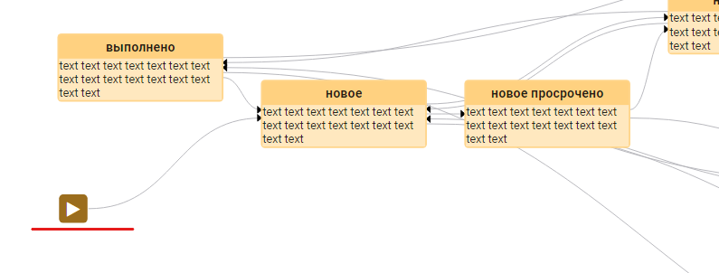
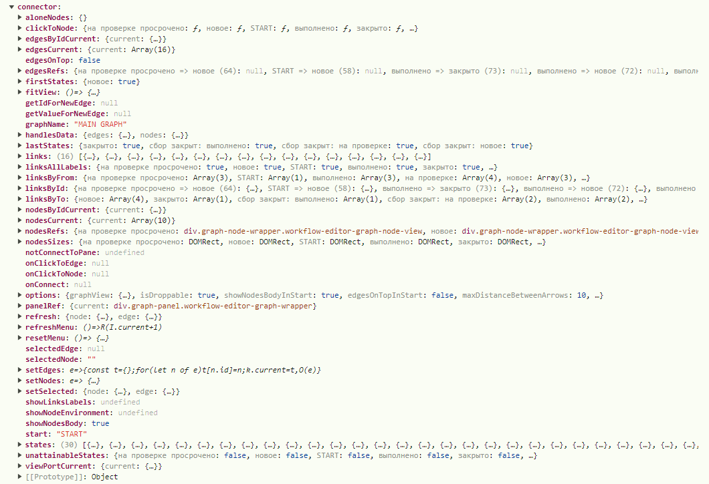
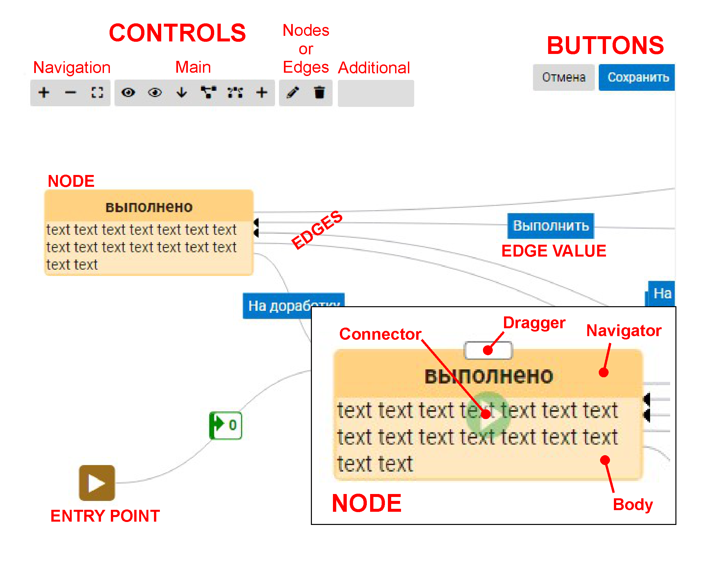

# Основные понятия

- [граф](thesaurus.md#граф)
- [узел](thesaurus.md#узел-графа) графа
- [связь](thesaurus.md#связь-графа) графа
- [висячий](thesaurus.md#висячий-узел) узел
- [стартовый](thesaurus.md#стартовый-узел) узел
- [конечный](thesaurus.md#конечный-узел) узел
- [недостижимый](thesaurus.md#недостижимый-узел) узел
- [точка входа](thesaurus.md#точка-входа-в-граф) в граф
- [ReactFlow](thesaurus.md#reactflow)
- [ReactFlowInstance](thesaurus.md#reactflowinstance)
- [коннектор](thesaurus.md#коннектор)
- [элеметны графа](thesaurus.md#элеметны-графа)

>
&emsp;\
&emsp;\
&emsp;

# Граф
 Математическая абстракция реальной системы любой природы, объекты 
 которой обладают парными связями.
 
 Граф как математический объект 
 есть совокупность двух множеств — множества самих объектов, 
 называемого множеством **вершин**, и множества их парных связей, 
 называемого множеством **рёбер**
>
[В начало](#основные-понятия)
&emsp;\
&emsp;\
&emsp;

# Узел графа
Понятие "**Узел** графа" является синонимом понятия "**Вершина** графа"

> В коде компоненты узлы имеют мнемонику **Node**
>
[В начало](#основные-понятия)
&emsp;\
&emsp;\
&emsp;

# Связь графа
Понятие "**Связь** графа" является синонимом понятия "**Ребро** графа"

> В коде компоненты связи имеют мнемонику **Edge** или **Link** в зависимости от
уровня кода

>
[В начало](#основные-понятия)
&emsp;\
&emsp;\
&emsp;

# Висячий узел
Узел называется **висячим**, если он не имеет с графом никаких связей

> В коде компоненты висячие узлы имеют мнемонику **Alone Nodes**

>
[В начало](#основные-понятия)
&emsp;\
&emsp;\
&emsp;

# Стартовый узел
В описании графа должна быть одна и только одна связь, в описании которой
отсутствует поле **from**. В этой связи в поле **to** содержится
**ID** (**label**) узла, который называется **стартовым**. Именно
на этот узел происходит переход из [точки входа](thesaurus.md#точка-входа-в-граф) в граф

> В коде компоненты стартовый узел имеют мнемонику **First Node**
[В начало](#основные-понятия)

&emsp;\
&emsp;\
&emsp;


># Конечный узел
**Конечным** узлом называется тот узел, из которого нет перехода на другой узел

> В коде компоненты конечные узлы имеют мнемонику **Last Nodes**
[В начало](#основные-понятия)

&emsp;\
&emsp;\
&emsp;

>
# Недостижимый узел
Узел называется **недостижимым**, если от точки входа в граф до него нет маршрута,
которые бы к нему привёл

> В коде компоненты недостижимые узлы имеют мнемонику **Unattainable Nodes**


>
[В начало](#основные-понятия)
&emsp;\
&emsp;\
&emsp;

# Точка входа в граф
**Точкой входа** в граф называется искусственно созданный компонентой узел,
которого нет в списке всех узлов, но с которого осуществляется вход в граф.



> В коде компоненты **точка входа** имеет мнемонику **start**

Та связь графа, которая имеет "**to**" но не имеет "**from**" и считается самой первой связью,
от **точки входа** "**start**" до первого узла графа "**to**"

>
[В начало](#основные-понятия)
&emsp;\
&emsp;\
&emsp;

# ReactFlow
[ReactFlow](https://reactflow.dev/) это библиотека для создания интерфейсов, основанных на отображении
данных в виде графов, используемая компонентой **Graph** в качестве основного движка

**ReactFlow** визуализирует узлы и ребра, обрабатывает взаимодействие с
пользователем и может управлять своим собственным состоянием


>
[В начало](#основные-понятия)
&emsp;\
&emsp;\
&emsp;

# ReactFlowInstance
[ReactFlowInstance](https://reactflow.dev/api-reference/types/react-flow-instance)
это набор методов для запроса
и управления внутренним состоянием потока [ReactFlow](thesaurus.md#reactflow)

Например:

````
const {x, y, zoom} = ReactFlowInstance.getViewport();
````
Данным вызовом мы получим значения масштаба редактируемого окна графа
и его смещения относительно начала координат


>
[В начало](#основные-понятия)
&emsp;\
&emsp;\
&emsp;

# Коннектор
Конструктор компоненты создаёт специальный объект **connector**

**Коннектор** - сложнейший объект, который включает в себя все основные свойства и методы
компоненты графа. Из него можно получить любую информацию и произвести любые действия.



Не рекомендуется к использованию напрямую. Старайтесь делать все действия
через **[контроллинг компоненты](controlling.md)**


[В начало](#основные-понятия)
&emsp;\
&emsp;\
&emsp;

# Элеметны графа
Компонента **Graph** обеспечивает отображение и взаимодействие между собой
набор определённых элементов. Для примера приводится один из
возможных способов отображения, который позволяет увидеть все элементы 
окна графа.

Однако надо иметь ввиду, что входные данные возможно отобразить абсолютно любым способом,
который внешне не будет иметь ничего общего с приведённым примером


|На картинке|Элемент|
|---|---|
|CONTROLS|кнопки управления графом|
|&emsp; Navigation|&emsp; навигация по графу|
|&emsp; Main|&emsp; основные функции управлением графа и параметры визуализации|
|&emsp; Nodes|&emsp; управление активным [узлом](thesaurus.md#узел-графа)|
|&emsp; Edges|&emsp; управление активной [связью](thesaurus.md#связь-графа)|
|&emsp; Additional|&emsp; пользовательские кнопки управления графом|
|BUTTONS|пользовательские внешние функции|
|EDGES| [связи](thesaurus.md#связь-графа) графа|
|EDGE VALUE| **value** [связи](thesaurus.md#связь-графа)|
|NODE| [узел](thesaurus.md#узел-графа)|
|&emsp; Connector|&emsp; область создания [связи](thesaurus.md#связь-графа) от [узла](thesaurus.md#узел-графа)|
|&emsp; Dragger|&emsp; область перемещения [узла](thesaurus.md#узел-графа)|
|&emsp; Navigator|&emsp; область размещения **label** [узла](thesaurus.md#узел-графа)|
|&emsp; Body|&emsp; основная информационная область [узла](thesaurus.md#узел-графа)|


[В начало](#основные-понятия)
>
&emsp;\
&emsp;\
&emsp;\
&emsp;\
&emsp;\
&emsp;\
&emsp;\
&emsp;\
&emsp;\
&emsp;\
&emsp;\
&emsp;\
&emsp;\
&emsp;\
&emsp;\
&emsp;\
&emsp;\
&emsp;\
&emsp;\
&emsp;\
&emsp;\
&emsp;\
&emsp;\
&emsp;\
&emsp;\
&emsp;\
&emsp;\
&emsp;\
&emsp;\
&emsp;\
&emsp;\
&emsp;\
&emsp;\
&emsp;\
&emsp;\
&emsp;\
&emsp;\
&emsp;\
&emsp;\
&emsp;\
&emsp;\
&emsp;\
&emsp;\
&emsp;\
&emsp;\
&emsp;\
&emsp;\
&emsp;\
&emsp;\
&emsp;\
&emsp;\
&emsp;\
&emsp;\
&emsp;\
&emsp;\
&emsp;\
&emsp;\
&emsp;\
&emsp;\
&emsp;\
&emsp;\
&emsp;\
&emsp;\
&emsp;\
&emsp;\
&emsp;\
&emsp;\
&emsp;\
&emsp;\
&emsp;


