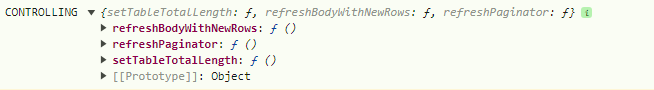

# TABLE

Запуск компоненты универсальной таблицы осуществляется двумя способами:

- встраиванием в JSX непосредственно самой компоненты:

####
    <Table {...tableProps} />
####

- вызовом функции из JS с указанием **portal** - места, где таблица должна будет разместиться в DOM-дереве:

####
    const portal = document.querySelector('#my-table');
    const {removeComponent} = callTable(portal, {...tableProps});
####
во втором случае в ответе получаем объект, содержащий **removeComponent** - функцию удаления компоненты
из DOM-дерева и всего, что с ней связано

# ПАРАМЕТРЫ

> tableProps = {\
&emsp;    [tableName](TABLE.md#tablename): 'myTable',\
&emsp;    [tableId](TABLE.md#tableid): 'my-table',\
&emsp;    [tableClassName](TABLE.md#tableclassNname): 'my-table',\
&emsp;    [data](TABLE.md#data): {...},\
&emsp;    [commonForHeader](TABLE.md#commonforheader): {...},\
&emsp;    [commonForBody](TABLE.md#commonforbody): {...},\
&emsp;    [editors](TABLE.md#editors): {...},\
&emsp;    [options](TABLE.md#options): {...},\
&emsp;    [onChangeComponentState](TABLE.md#onchangecomponentstate): {...},\
&emsp;    [getComponentControlling](TABLE.md#getcomponentcontrolling): () => {},\
}

## tableName
Обязательный. Уникальное имя таблицы. Нужно для сохранения
юзеровских настроек таблицы в localeStorage.
Должно быть одинаковым только для таблиц совершенно идентичной структуры, набора столбцов и 
логического смысла.

## tableId
Необязательный. Если есть, то корню таблицы в DOM-дереве будет присвоен этот ID

## tableClassName
Необязательный. Если есть, то корню таблицы в DOM-дереве будет присвоен этот класс

## data
Обязательный. Обьект с собственно данными самой таблицы.

        data: {
            header: [...],
            rows: [...],
            params: {
                pageNum: 0,
                pageLength: 100,
                totalLength: undefined,
            },
        },

- **header** - данные шапки таблицы. Описание смотри в **[header-format](header-format.md)**
- **rows** - данные строк таблицы. Описание смотри в **[rows-format](rows-format.md)**
- params.**pageNum** - номер текущей страницы. При вызове таблицы всегда === 0
- params.**pageLength** - количество строк на странице
- params.**totalLength** - общее количество строк таблицы. Если не известно, то === undefined

## commonForHeader

Необязательный. Кастомизация всех ячеек заголовка таблицы
````
commonForHeader: {
    view: data => <div className="header-any-cell">{data.label}</div>,
}
````

### view
Кастомное представление всех ячеек заголовка таблицы

Перед отрисовкой любой ячейки заголовка таблицы происходит проверка, есть ли для неё кастомное представление, и если есть, то оно вызывается и в параметр ему подаётся изначальный объект, описывающий эту ячейку во входных параметрах, внутри которого добавлен служебный объект "_", в котором можно найти кучу информации о данной ячейке в таблице, вплоть до адреса в DOM-дереве

## commonForBody
Необязательный. Кастомизация всех ячеек тела таблицы
````
commonForBody: {
    view: data => <div className="body-any-cell">{data.label}</div>,
    isEditable: true,
    css: {background: '#ff0'},
    customizer: {...},
}
````
### view
Кастомное представление всех ячеек тела таблицы

Перед отрисовкой любой ячейки тела таблицы происходит проверка, есть ли для неё кастомное представление, и если есть, то оно вызывается и в параметр ему подаётся изначальный объект, описывающий эту ячейку во входных параметрах, внутри которого добавлен служебный объект "_", в котором можно найти кучу информации о данной ячейке в таблице, вплоть до адреса в DOM-дереве


### isEditable
По умолчанию === false

Признак разрешения редакции всех ячеек тела таблицы

### css
Дополнительные свойства CSS всех ячеек тела таблицы

## customizer
Условное форматировние. Добавление css-свойств всем ячейкам тела таблицы если выполняются заданные условия

Подробнее см. **[customizer](customizer.md)**


## editors
Необязательный. Определяет какие редакторы будут использоваться для различных
элементов таблицы

    editors: {
        cellEditor: 'text or Component'
    },

### cellEditor
Определяет редактор ячеек таблицы. Может принимать значения:

- текст '**internal**' - будет использоваться внутренний редактор компоненты.
Это просто **input** текста
- текст '**TableCellEditor**' - будет использоваться стандартный редактор 
ячейки из **../TableCellEditor**
- кастомная компонента - будет использоваться она

По умолчанию 'internal'

## options
Необязательный. Параметры настройки внешнего вида и поведения таблицы. 
Описание смотри в **[options](options.md)**

## onChangeComponentState
Обязательный. Набор обработчиков событий, происходящих в таблице

    onChangeComponentState: {
        onClickToPaginator_ShowLength: () => {},
        onClickToPaginator_RowsByPage: () => {}, 
        ...
    },

Подробнее см. в **[events](events.md)**

## getComponentControlling
Обязательный. Эта функция, котороую вызовет компонента после её первоначальной отрисовки,
и в которую (в параметре) положит объект с набором функций, позволяющих управлять поведением
таблицы извне

    const getComponentControlling = data => {
        console.log('CONTROLLING', data)
    }


Подробно о функциях контроллинга таблицы смотри в **[controlling](controlling.md)**

>
&emsp;\
&emsp;\
&emsp;\
&emsp;\
&emsp;\
&emsp;\
&emsp;\
&emsp;\
&emsp;\
&emsp;\
&emsp;\
&emsp;\
&emsp;\
&emsp;\
&emsp;\
&emsp;\
&emsp;\
&emsp;\
&emsp;\
&emsp;\
&emsp;\
&emsp;\
&emsp;\
&emsp;\
&emsp;\
&emsp;\
&emsp;\
&emsp;\
&emsp;\
&emsp;\
&emsp;\
&emsp;\
&emsp;\
&emsp;\
&emsp;\
&emsp;\
&emsp;\
&emsp;\
&emsp;\
&emsp;
