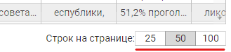

# CONTROLLING

[getComponentControlling](TABLE.md#getcomponentcontrolling) компоненты **Table**
возвращает набор методов, позволяющих не только
узнать состояние **таблицы**, но и управлять этим
состоянием

## Методы контроллинга

- [refreshBodyWithNewRows](#refreshbodywithnewrows)
- [setTableTotalLength](#settabletotallength)
- [refreshPaginator](#refreshpaginator)
- [refreshTable](#refreshtable)

# refreshBodyWithNewRows
````
refreshBodyWithNewRows({
    newRows: Array,
    newPageNum: Number,
    newPageLength: Number,
    openAllLevels: Bool,
});
````
Параметры:

### newRows
Обязательный. Новый список строк тела таблицы. Применяется в разных случаях, например при переходе 
на новую страницу, получения страницы после применения сортировки или фильтра, и т.д.

### newPageNum
Необязательный. Применяется в случае смены номера текущей страницы таблицы (практически всегда)

### newPageLength
Необязательный. Добавляется в случае смены размера страницы



### openAllLevels
Необязательный. Применяется (===true) в случае если после отрисовки страницы необходимо
принудительно полностью развернуть дерево вложенности строк

# setTableTotalLength
````
setTableTotalLength(length);
````
### length
Общее количество строк в таблице. Изначально этот параметр может быть неизвестен. Так вот если на 
верхнем уровне это значение вдруг стало известным, его надо сообщить компоненте.

Вызов функции не приводит к визуальным изменениям в пагинаторе.

# refreshPaginator
````
refreshPaginator();
````
Применяется для принудительного обновления визуализации пагинатора. Нужен, например, после 
вызова **setTableTotalLength**

# refreshTable
````
refreshTable();
````
Применяется для принудительного обновления всей таблицы в случаях когда
меняюется общая длина табдицы. Например, после удаления или добавления новых строк

Следует внимательно применять данный метод. Например, вы стояли на последней странице
и добавили (удалили) несколько строк в конец таблицы. Изменив в данных таблицы параметр 
tableProps.data.params.**totalLength** (если он известен), обращайте внимание на такие ситуации:

- не увеличилось (уменьшилось) ли количество страниц
- правильное ли количество строк в tableProps.data.**rows**
- правильно ли установлен tableProps.data.params.**pageNum**

Чтобы застраховаться от всех этих неожиданностей советую не добавлять ручками 
строки на фронте, а заново сделать запрос на сервер и прочитать нужную страницу
перед вызовом **refreshTable()**


### <span style="background:red; color:white;">По мере добавления новых функций описание будет расширяться

>
&emsp;\
&emsp;\
&emsp;\
&emsp;\
&emsp;\
&emsp;\
&emsp;\
&emsp;\
&emsp;\
&emsp;\
&emsp;\
&emsp;\
&emsp;\
&emsp;\
&emsp;\
&emsp;\
&emsp;\
&emsp;\
&emsp;\
&emsp;\
&emsp;\
&emsp;\
&emsp;\
&emsp;\
&emsp;\
&emsp;\
&emsp;\
&emsp;\
&emsp;\
&emsp;\
&emsp;\
&emsp;\
&emsp;\
&emsp;\
&emsp;\
&emsp;\
&emsp;\
&emsp;\
&emsp;\
&emsp;\
&emsp;\
&emsp;\
&emsp;\
&emsp;\
&emsp;\
&emsp;\
&emsp;\
&emsp;\
&emsp;\
&emsp;\
&emsp;\
&emsp;\
&emsp;


