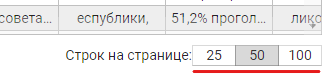

# EVENTS

При построении таблицы
через объект [onChangeComponentState](TABLE.md#onchangecomponentstate)
можно подписаться на события, которые происходят внутри компоненты и каждому этому
событию назначить свой обработчик

Компонент таблицы позволяет подписаться на следующие события:

| Событие                                                         | Когда происходит                                                 |
|-----------------------------------------------------------------|------------------------------------------------------------------|
| [onClickToPaginator_ShowLength](#onclicktopaginator_showlength) | клик на пагинаторе по ссылке "показать"                          |
| [onClickToPaginator_RowsByPage](#onclicktopaginator_rowsbypage) | клик на пагинаторе по выбору количества строк на странице        |
| [onClickToPaginator_GoToPage](#onclicktopaginator_gotopage)     | клик на пагинаторе по кнопкам навигации начало/предыд/след/конец |
| [onChangeFilterOrSort](#onchangefilterorsort)                   | запуск поиска или сортировки                                     |
| [onChangeCell](#onchangecell)                                   | изменилось содержимое ячейки                                     |

## onClickToPaginator_ShowLength
Клик на пагинаторе по ссылке "показать"

Отловив это событие, необходимо запросить у сервера общую длину таблицы (с учётом текущих значений фильтров и сортировки)
и передать это значение в компоненту
(как это сделать - см. **[setTableTotalLength](controlling.md#settabletotallength)**)

**ПРИНИМАЕМЫЕ ПАРАМЕТЫ:**\
нет

## onClickToPaginator_RowsByPage

Клик на пагинаторе по выбору количества строк на странице

При возникновении этого события, необходимо запросить у сервера нулевую страницу таблицы с указанной длиной
и передать её в компоненту
(как это сделать - см. **[refreshBodyWithNewRows](controlling.md#refreshbodywithnewrows)**)

**ПРИНИМАЕМЫЕ ПАРАМЕТЫ:**\
Число - количество строк на странице

## onClickToPaginator_GoToPage

Клик на пагинаторе по кнопкам навигации начало/предыд/след/конец

Необходимо запросить у сервера нужную страницу и передать её в компоненту
(как это сделать - см. **[refreshBodyWithNewRows](controlling.md#refreshbodywithnewrows)**)

**ПРИНИМАЕМЫЕ ПАРАМЕТЫ:**\
Число - номер сраницы

## onChangeFilterOrSort

Данное событие возникает когда юзер запускает сортировку по колонке или задаёт контекст поиска (фильтры)

При срабатывании этого события необходимо запросить у сервера нулевую страницу таблицы с
указанными фильтрами и сортировкой. Получив ответ, необходимо передать его в компоненту
(как это сделать - см. **[refreshBodyWithNewRows](controlling.md#refreshbodywithnewrows)**)

**ПРИНИМАЕМЫЕ ПАРАМЕТЫ:**

    const onChangeFilterOrSort = props => {
        const {header, searchContext, sortCell} = props;
        ...
    }

#### header
Данные заголовка (шапки) таблицы, каждый элемент которой пополнен служебным объектом "_"

В этом объекте можно найти данные по контексту поиска и сортировке в каждой колонке таблицы
(searchContext и sort)

Конечно, перебрав все элементы header можно понять где что сортируется и фильтруется, но для облегчения этой
задачи компонента передаст еще два элемента: **searchContext** и **sortCell**

#### searchContext
Так как колонок с фильтром может быть несколько, то все контексты поиска компонента таблицы собирает в 
одну кучу - массив. Порядковый номер в этом массиве соответствует конечным (без **children**) 
ячейкам шапки таблицы (параметр **endIndex** в "**_**")

#### sortCell
Так как сортировка может происходить только по одному столбцу таблицы, то в параметре **sortCell**
будет находиться ссылка на непосредственно тот элемент ячейки в **header**, по которому происходит сортировка

## onChangeCell
Значение ячейки было изменено

При срабатывании этого события необходимо сохранить изменения на сервере

**ПРИНИМАЕМЫЕ ПАРАМЕТЫ:**

    const onChangeCell = props => {
        const {cell, oldValue, newValue, row} = props;
        ...
    }

| Параметр | Содержимое                   |
|----------|------------------------------|
| **cell**     | изменённая ячейка таблицы    |
| **oldValue** | старое значение value ячейки |
| **newValue** | новое значение value ячейки  |
| **rows**     | вся таблица целиком          |

>
&emsp;\
&emsp;\
&emsp;\
&emsp;\
&emsp;\
&emsp;\
&emsp;\
&emsp;\
&emsp;\
&emsp;\
&emsp;\
&emsp;\
&emsp;\
&emsp;\
&emsp;\
&emsp;\
&emsp;\
&emsp;\
&emsp;\
&emsp;\
&emsp;\
&emsp;\
&emsp;\
&emsp;\
&emsp;\
&emsp;\
&emsp;\
&emsp;\
&emsp;\
&emsp;\
&emsp;\
&emsp;\
&emsp;\
&emsp;\
&emsp;\
&emsp;\
&emsp;\
&emsp;\
&emsp;\
&emsp;\
&emsp;\
&emsp;\
&emsp;\
&emsp;\
&emsp;\
&emsp;\
&emsp;\
&emsp;

