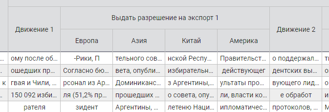
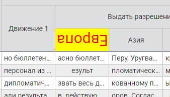
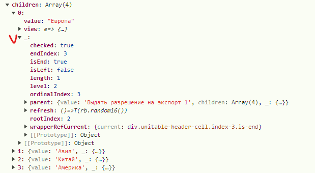

# HEADER

Формат заголовка таблицы:

####
    header = [header_1, header_2, ...]

Формат элемента заголовка таблицы:

````
    header_X = {
        value: 'text',
        children: [header_A, header_B, ...]
        columns: {
            isEditable: true,
            view: () => {},
            css: {...},
            customizer: {...},
        }
        view: () => {},
        other: ...,
    }
````

## value
Обязательный. Текст, который непосредственно выводится в ячейке заголовка таблицы.

## children
Необязательный. Используется для реализации древовидной структуры колонок. Перечисленные в 
**children** элементы являются дочерними по отношению к текущей ячейке

Например



Для реализации этого участка таблицы структура **header** будет следующей:

````
    [
        ...
        {value: 'Движение 1'},
        {
            value: 'Выдать разрешение на экспорт 1',
            children: [
                {value: 'Европа'},
                {value: 'Азия'},
                {value: 'Китай'},
                {value: 'Америка'},
            ]
        },
        {value: 'Движение 2'},
        ...
    ]
````

# <span style="color:red">ВНИМАНИЕ!!!</span>
Размерность таблицы по ширине определяется автоматически по количеству элементов **header**,
на любом уровне вложенности **НЕ имеющих** элемента **children**. Сказать по-другому - по количеству 
конечных ячеек (примыкающих к телу таблицы). В приведённом выше примере размерность = 6.

## columns.isEditable
Необязательный. Признак того, что все ячейки данного столбца в теле таблицы редактируемые

Флаг распространяется по дереву вниз. То есть, если флаг установлен в родительском элементе,
то у всех потомков, у которых нет его принудительного отключения, флаг будет
считаться установленным

## columns.view
Необязательный. Предназначен для подмены стандартного представления всех ячеек тела
таблицы соответствующего столбца кастомным

Флаг распространяется по дереву вниз. То есть, если представлеие определено
в родительском элементе,
то у всех потомков прадставление будет
считаться заданным

## columns.css
Необязательный. Дополнительный CSS ячеек данного столбца в теле таблицы.
Установленные свойства распространяется по дереву вниз. Например, если у родителя установлен 
красный цвет фона, то у всех его потомков будет красный цвет фона. Добавление у потомка 
размера шрифта не отменяет добавление цвета у родителя, а добавляет ему и его потомкам размер 


## columns.customizer
Необязательный. Условное форматировние. Добавление css-свойств ячейкам столбца если выполняются заданные условия

Установленные свойства распространяется по дереву вниз аналогично параметру "css"

Подробнее см. **[css-if](css-if.md)**


## view
Необязательный. Предназначен для подмены стандартного представления ячейки заголовка таблицы кастомным

При помощи
этого механизма возможно любую ячейку заголовка отобразить по своему усмотрению (кастомизировать).
Компонента, видя что есть **view** не будет отрисовывать в ячейке **value** (как по умолчанию),
а вызовет функцию и в ячейке разместит то, что вернёт эта функция.

        const view = cell => {
            if(cell._.wrapperRefCurrent?.current) {
                cell._.wrapperRefCurrent.current.style.background = '#ff0';
            }
            return (
                <div
                    style={{
                        transform: 'rotate(180deg)',
                        'font-size': '30px', color: '#f00'
                    }}
                >{cell.value}</div>
            )
        }



Функция **view** будет вызвана с единственным параметром, в котором будет лежать текущий 
header_X, внутрь которого будет добавлен объект "_"



В этом объекте располагается куча полезной информации о ячейке, её местоположении в иерархии
вплоть до ссылки на ячейку в DOM-дереве

## other
В данных ячейки заголовка таблицы могут присутствовать любые данные, необходимые
для работы с ней на уровне вызывающего кода. Эти данные компонента игнорирует, никак не обрабатывает
и во всех колбэках возращает в целости и сохранности.


