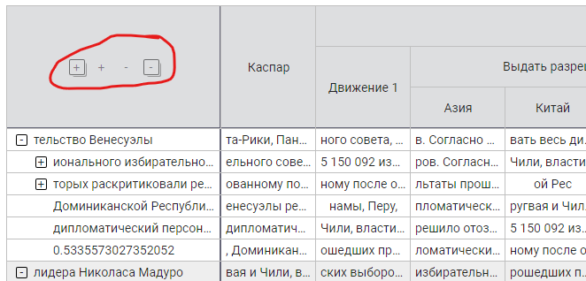
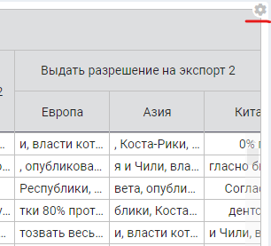

# OPTIONS

Структура объекта опций при построении таблицы

> options: {\
&emsp;    [numberFixedLeftColumns](#numberfixedleftcolumns): Number,\
&emsp;    [tableHasRowsTree](#tablehasrowstree): Bool,\
&emsp;    [showTableSettings](#showtablesettings): Bool,\
&emsp;    [editableSettings](#editablesettings): {...},\
&emsp;    [background](#background): {...},\
&emsp;    [resize](#resize): {...},\
&emsp;    [initialSizes](#initialsizes): {...},\
&emsp;    [columnsMenu](#columnsmenu): {...},\
&emsp;    [paginator](#paginator): {...},\
&emsp;    [other](#other): {...},\
},

## numberFixedLeftColumns
Таблица может иметь слева любое количество зафиксированных столбцов (а может и не иметь).
За это количество отвечает опция **numberFixedLeftColumns**

Зафиксированные слева столбцы имеют следующие ограничения:

- они не скроллируются
- они не могут быть перемещены вправо/влево (и даже между собой)
- они не могут быть скрытыми

## tableHasRowsTree
Опция говорит компоненте о наличии древовидной структуры строк. Если **tableHasRowsTree === true**,
то парсер строк проверяет наличие параметра **children** в их описании и строит соответствующее дерево
Если опция не установлена, то анализ проводиться не будет и тогда даже древовидная структура 
будет представлена как плоская с выводом строк только нулевого уровня.

В случае древовидной структуры строк самая первая ячейка заголовка таблицы игнорируется и на её 
месте отображается панель управления уровнями дерева строк

## showTableSettings
Опция отвечает за доступность меню таблицы

## editableSettings
    editableSettings: {
        bgrEvenRows: true,
        bgrOddRows: true,
        bgrHeader: true,
        bgrHover: true,
        resizeHeaderHeight: true,
        resizeColumnsWidth: true,
        resizeRowsHeight: true,
        colHasHideIcon: true,
        colHasOrderIcon: true,
        colHasSearchIcon: true,
        colHasFormatIcon: true,
        colHasSortIcon: true,
        showHints: true,
        searchLogicAND: true,
        isHovered: true,
    },
Опция отвечает за то, какие именно параметры настройки таблицы будут доступны для изменения юзером

- Цвет фона
  - **bgrEvenRows** - _чётных строк_
  - **bgrOddRows** - _нечётных строк_
  - **bgrHeader** - _шапки таблицы_
  - **bgrHover** - _строки и столбца на пересечении ячейки под курсором_

- Можно менять размер
  - **resizeHeaderHeight** - _высоту заголовка таблицы_
  - **resizeColumnsWidth** - _ширину колонок_
  - **resizeRowsHeight** - _высоту строк тела таблицы_

- В меню колонки есть иконка
  - **colHasHideIcon** -  _скрытия колонки_
  - **colHasOrderIcon** - _смены последовательности колонок_
  - **colHasSearchIcon** - _контекстного поиска_
  - **colHasFormatIcon** - _форматирования колонки_
  - **colHasSortIcon** - _сортировки по колонке_

- Прочее
  - **showHints** - _показывать всплывающую подсказку над переполненной ячейкой_
  - **searchLogicAND** - _контекстный поиск с конъюнкцией_
  - **isHovered** - _выделять строку и столбец на перекрёстке ячейки под курсором_

## background
    background: {
        evenRows: false,
        oddRows: '#eee',
        header: '#ddd',
        hovered: '#ebf3fd',
    },

Начальные значения для цветов фона:
- **evenRows** - _чётных строк_
- **oddRows** - _нечётных строк_
- **header** - _шапки таблицы_
- **hovered** - _строки и столбца на пересечении ячейки под курсором_

## resize
    resize: {
        headerHeight: true,
        columnsWidth: true,
        rowsHeight: true,
    },

Признаки того что можно менять размеры:
- **headerHeight** - _высоту заголовка таблицы_
- **columnsWidth** - _ширину колонок_
- **rowsHeight** - _высоту строк тела таблицы_

## initialSizes
    initialSizes: {
        headerHeight: Number,
        rowsHeight: Number,
        columnsWidth: Number || String || Array,
    },

Размеры элементов таблицы. Применяется, как правило, вместе с запретом ресайзинга этих элементов

### headerHeight
Высота шапки таблицы. Число в пикселях

### rowsHeight
Высота строк тела таблицы. Число в пикселях

### columnsWidth
Ширина колонок таблицы. Использоваться может в двух вариантах:

- **одиночное** значение (если все столбцы одной ширины)
- **массив** значений (по количествоу столбцов или меньше)

В свою очередь само значение (одиночное или массив) может быть использовано в следующий форматах:

1) **Number** - ширина в пикселях
2) String "**55px**" - ширина в пикселях
3) String "**1,5%**" - ширина в процентах от общей ширины таблицы.
4) null || undefined || "" - ширина этих столбцов будет распределена равномерно до заполнения общей ширины таблицы

#### ПРИМЕРЫ:

Примеры приведены для таблицы в **6 столбцов**

|формат|Ширина|
|---|---|
| undefined | 1, 2, 3, 4, 5, 6 - поровну на всю ширину таблицы |
| "" | 1, 2, 3, 4, 5, 6 - поровну на всю ширину таблицы |
| 25 или "25" или "25px" | 1, 2, 3, 4, 5, 6 - 25 пикселей |
| "25%" | 1, 2, 3, 4, 5, 6 - 25 процентов от общей ширины таблицы |
| [20, '20', '20px', '30%', 50, 50] | 1, 2, 3 - 20 пикселей, 4 - 30 процентов от общей ширины таблицы, 5, 6 - 50 пикселей |
| [20, '20', '20px', '', '', ''] | 1, 2, 3 - 20 пикселей, 4, 5, 6 - одной ширины до заполнения всей ширины таблицы |
| [20, ,'20'] | 1, 3 - 20 пикселей, 2, 4, 5, 6 - одной ширины до заполнения всей ширины таблицы |
| [ , , , , , 20] | 6 - 20 пикселей, 1, 2, 3, 4, 5 - одной ширины до заполнения всей ширины таблицы |
| [ , , '10%'] | 3 - 10% от общей ширины таблицы, 1, 2, 4, 5, 6 - одной ширины до заполнения всей ширины таблицы |

## columnsMenu
    columnsMenu: {
        hasHideIcon: true,
        hasOrderIcon: true,
        hasSearchIcon: true,
        hasFormatIcon: true,
        hasSortIcon: true,
    },

Признаки того что меню столбцов имеет иконки:
- **hasHideIcon** -  _скрытия колонки_
- **hasOrderIcon** - _смены последовательности колонок_
- **hasSearchIcon** - _контекстного поиска_
- **hasFormatIcon** - _форматирования колонки_
- **hasSortIcon** - _сортировки по колонке_

## paginator
    paginator: {
        rowsByPage: [25, 50, 100],
    },

### rowsByPage
Список допустимых размеров страниц

## other
    other: {
        showHints: true,
        searchLogicAND: true,
        highlightHovered: false,
    },

- **showHints** - _оказывать всплывающую подсказку над переполненной ячейкой_
- **searchLogicAND** - _контекстный поиск с конъюнкцией_
- **highlightHovered** - _выделять строку и столбец на перекрёстке ячейки под курсором_
>
&emsp;\
&emsp;\
&emsp;\
&emsp;\
&emsp;\
&emsp;\
&emsp;\
&emsp;\
&emsp;\
&emsp;\
&emsp;\
&emsp;\
&emsp;\
&emsp;\
&emsp;\
&emsp;\
&emsp;\
&emsp;\
&emsp;\
&emsp;\
&emsp;\
&emsp;\
&emsp;\
&emsp;\
&emsp;\
&emsp;\
&emsp;\
&emsp;\
&emsp;\
&emsp;\
&emsp;\
&emsp;\
&emsp;\
&emsp;\
&emsp;\
&emsp;\
&emsp;\
&emsp;\
&emsp;\
&emsp;\
&emsp;\
&emsp;\
&emsp;\
&emsp;\
&emsp;\
&emsp;
