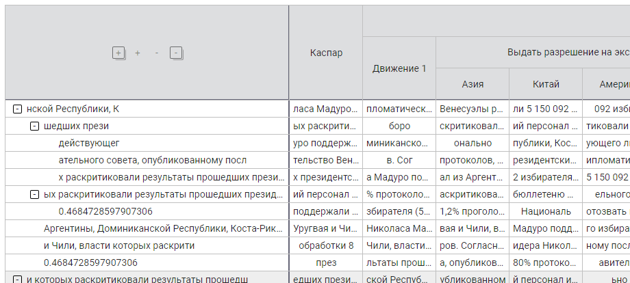
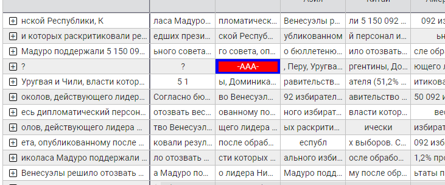
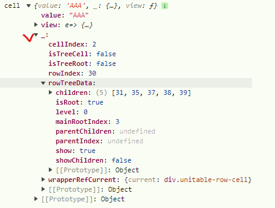

# ROWS
Формат тела таблицы:

####
    rows = [row1, row2, ... ]
####

Формат строки тела таблицы:

    rowX = {
        children: [rowA, rowB, ...],
        css: {...},
        row: [cell1, cell2, ...],
    }

## children
Необязательный. Используется для реализации древовидной структуры строк. Перечисленные в
**children** элементы являются дочерними по отношению к текущей строке

## css
Необязательный. Используется определения дополнительных стилей для всей строки

## row
Обязательный. Является набором ячеек текущей строки. Имеет размерность, определяемую
автоматически по заголовку таблицы (смотри в **header-format.md**)

    row = [cell1, cell2, ...],

## cell
Формат ячейки тела таблицы:

    cellX = {
        value: 'text',
        isEditable: true,
        view: () => {},
        other: ...
    }

### value
Обязательный. Текст, который непосредственно выводится в ячейке тела таблицы.

### isEditable
Необязательный. Признак возможности редакции ячейки. Если у соответствующего столбцу элемента заголовка
установлен такой флаг, то все ячейки данного столбца редактируются, но приоритетом пользуется
флаг самой ячейки. Даже если весь столбец 
редактируется но в конкретной ячейке **isEditable === false**,
то редакция будет запрещена.

### view
Необязательный. Предназначен для подмены стандартного представления ячейки кастомным. При помощи
этого механизма возможно любую ячейку тела таблицы отобразить по своему усмотрению (кастомизировать).
Компонента, видя что есть **view** не будет отрисовывать в ячейке **value** (как по умолчанию),
а вызовет функцию и в ячейке разместит то, что вернёт эта функция.

    const view = cell => {
        const style = {background: '#f00', color: '#fff'}
        if(cell._.wrapperRefCurrent?.current) cell._.wrapperRefCurrent.current.style.background = '#00f';

        return (
            
-{cell.value}-

        )
    }

Функция **view** будет вызвана с единственным параметром, в котором будет лежать текущий
cellX, внутрь которого будет добавлен объект "_"

В этом объекте располагается куча полезной информации о ячейке, её местоположении в иерархии
вплоть до ссылки на ячейку в DOM-дереве

### other
В данных ячейки тела таблицы могут присутствовать любые данные, необходимые
для работы с ней на уровне вызывающего кода. Эти данные компонента игнорирует, никак не обрабатывает
и во всех колбэках возращает в целости и сохранности.

