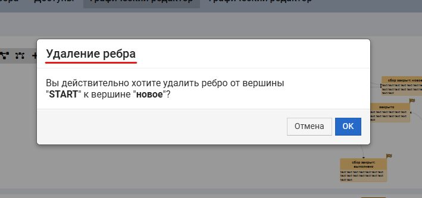
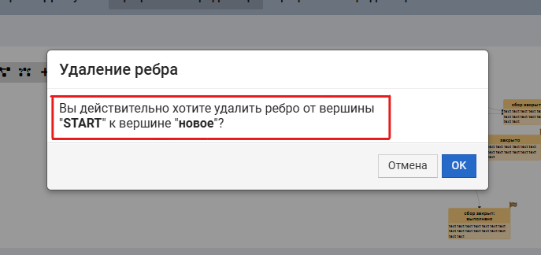
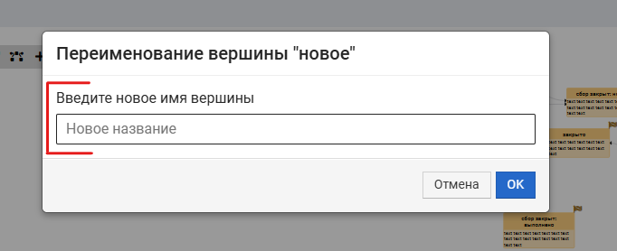
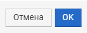

# ALERT

Всплывающая панель с сообщением

Посроение всплывающей панели осуществляется двумя способами:

1. **встраиванием в JSX** непосредственно самой компоненты
    ````
    <Alert {...alertProps} />
    ````
2. **вызовом функции из JS**

    ````
    const {removeComponent} = callAlert({...alertProps});
    ````
   во втором случае в ответе получаем **removeComponent** - функцию удаления компоненты
   из DOM-дерева и всего, что с ней связано

# ПАРАМЕТРЫ alertProps

| Имя                                 | Тип                      | Назначение                                                  |
|-------------------------------------|------------|-------------------------------------------------------------|
| [header](#header)                   | Text, html               | Заголовок панели                                            |
| [text](#text)                       | Text, html               | Сообщение или предупреждение                                |
| [children](#children)               | Component                | Кастомное представление информационного блока панели        |
| [success](#success/cancel)          | Function        | Описание кнопки утвердительного ответа                      |
| [cancel](#success/cancel)           | Function        | Описание кнопки отрицательного ответа                       |
| [buttons](#buttons)                 | Array | Описание кастомных кнопок                                   |
| [removeComponent](#removecomponent) | Function   | Функция, вызов которой должен привести к удалению компненты |

## header

Заголовок всплывающей панели. Может содержать как текст, так и HTML-разметку



Необязательный параметр. Если этот параметр отсутствует,
на месте заголовка будет размещён текст "Предупреждение"

## text

Основное содержимое информационного поля панели. Может содержать как текст, так и HTML-разметку



## children

Альтернатива параметра **text**. Здесь можно передать компоненту, которая будет выводиться вместо текста
(если текст отсутствует) или под текстом (если присутствует)



## success/cancel

Если есть эти два параметра, то на панели автоматически отрисовываются две кнопки



В параметрах указываются колбэки, которые будут вызваны при клике на соответствующую кнопку

## buttons

Array c описанием кастомных кнопок панели

````
   buttons = [button1, button2, ...,buttonN]
````

Формат описания кнопки:

````
   button = {
      text: "...",
      type: "...",
      callback: () => {},
   }
````

| Параметр   | Тип                         | Назначение                                           |
|------------|-----------------------------|------------------------------------------------------|
| text       | Text                        | текст кнопки                                         |
| type       | текст "danger" или "cancel" | цвет кнопки                                          |
| callback   | Function                    | колбэк, который будет вызываться при клике на кнопку |

Если есть параметр **buttons**, то параметры success/cancel игнорируются


## removeComponent

Процедура удаления компоненты. Если она есть, то в этом случае
клик по любой кнопке панели (в конце всех действий) будет приводить к вызову этой функции

Это обеспечивает автоматическое закрытие панели при ответе на любой вопрос (клике на любую кнопку)