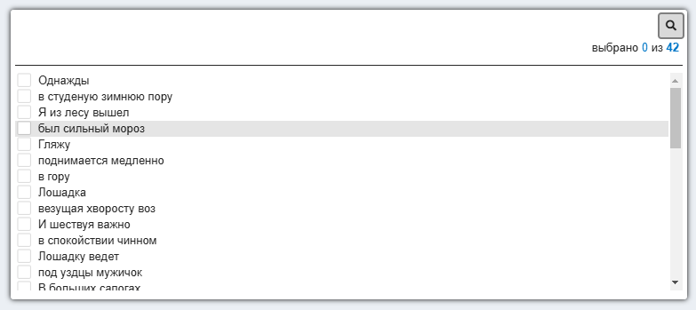
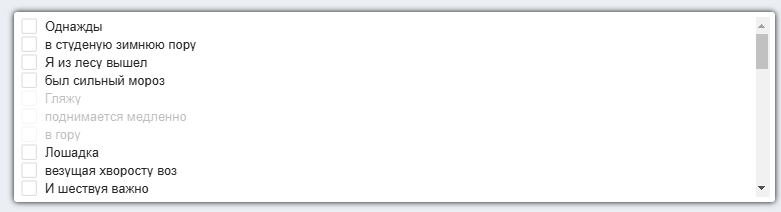
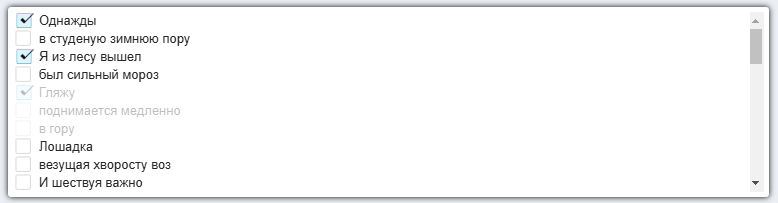
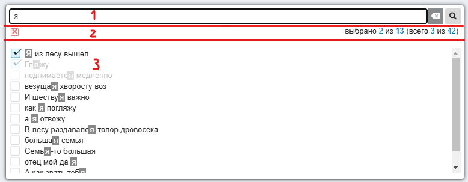
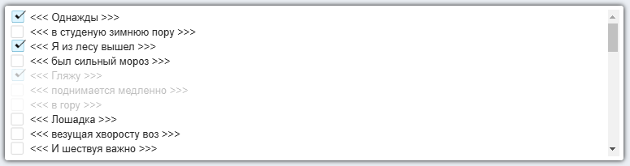

# LISTPICKER

Компонента позволяет выводить список элементов для одиночного или множественного выбора



Построение списка осуществляется вызовом реакт-компоненты

````
<ListPicker {...listPickerProps}>
````

# ПАРАМЕТРЫ listPickerProps

| Имя                                 | Тип       | Назначение                   |
|-------------------------------------|-----------|------------------------------|
| label                               | String    | имя списка для идентификации |
| [list](#list)                       | Array     | список элементов для выбора  |
| [selectedValue](#selectedValue)     | String    | Список выбранных элементов  |
| [selectedValues](#selectedValues)   | Array     | Список выбранных элементов (альтернатива selectedValue)  |
| [onChange](#onChange)               | Function  | колбэк, вызываемый при изменении списка выбранных элементов   |
| isMultiSelect                       | Bool      | признак множественного выбора |
| [hideSearchBar](#hideSearchBar)     | Bool      | признак отрисовки области поиска |
| [hideCountersBar](#hideCountersBar) | Bool      | признак отрисовки области счётчиков |
| [ItemViewName](#ItemViewName)       | Component | Кастомныое представление строки списка  |
| extraClass                          | String    | дополнительные классы обёртки компоненты |

## list

Массив элементов списка. Каждый элемент массива может иметь любой из двух форматов:

- просто текст
- объект, в котором есть обязательное поле **label**, и необязательное поле **notAvailable** -
признак недоступности элемента для выбора

````
    list={[
        'Однажды',
        'в студеную зимнюю пору',
        'Я из лесу вышел',
        'был сильный мороз',
        {label: 'Гляжу', notAvailable: true},
        {label: 'поднимается медленно', notAvailable: true},
        {label: 'в гору', notAvailable: true},
        'Лошадка',
        'везущая хворосту воз',
        'И шествуя важно',
        ...
    ]}
````


## selectedValue

Строка, в которой через запятую с пробелом (обязательно с пробелом!) перечислены выбранные элементы
````
    selectedValue="Я из лесу вышел, Однажды, Гляжу"
````


## selectedValues

Альтернативный **selectedValue** способ задать выбранные элементы. Это массив с текстом элементов

````
selectedValues={['Я из лесу вышел', 'Однажды', 'Гляжу']}
````


## onChange

Колбэк, вызываемый при смене выбора пользователем

При вызове **onChange** в параметрах находится объект, который имеет следующие параметры:

- **inputType** - тип input-а
- **label** - входной label компоненты
- **list** - входной list компоненты
- **selectedValues** - Array c текущим списком заселекченых элементов

## hideSearchBar

По умолчанию компонента состоит из трёх областей:

1. область контекстного поиска
2. область счётчиков
3. область выбора из списка



В области контекстного поиска можно осуществлять выборку из списка, в случае, если он очень большой.
Причём заданный контекст поиска подсвечивается в найденных строках

Если установлен флаг **hideSearchBar**, то область контекстоного поиска отображаться не будет.

## hideCountersBar

Область счётчиков нужна для того, чтобы ориентироваться в общем количестве элементов и количестве 
выбранных элементов

Цифры в области счётчиков на предыдущем скриншоте означают:

- **выбрано 2** - количество заселекченых элементов в выборке контекстного поиска "я"
- **из 13** - общее количество элементов в выборке контекстного поиска "я"
- **всего 3** - количество заселекченых элементов в списке **list**
- **из 42** - общее количество элементов в списке **list**

Если установлен флаг **hideCountersBar**, то область счётчиков отображаться не будет.

## ItemViewName

Кастомное представление строки списка

````
ItemViewName={props => <div>{`<<< ${props.item.label} >>>`}</div>}
````

