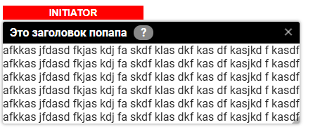

# MOVABLEPOPUP

Всплывающая панель с кастомным содержимым

Посроение всплывающей панели осуществляется двумя способами:

1. **встраиванием в JSX** непосредственно самой компоненты:
    ````
    <MovablePopup {...popupProps}>
        <Content ... />
    </MovablePopup>
    ````
2. **вызовом функции из JS** с указанием в параметрах **portal** - места, 
где таблица должна будет разместиться в DOM-дереве. Параметр **portal** может быть как
элементом DOM-дерева, так и просто селектором

    ````
    const portal = document.querySelector('#abcd');
    или
    const portal = 'body';
   
    const {removeComponent} = callMovablePopup({portal, ...popupProps});
    ````
    во втором случае в ответе получаем **removeComponent** - функцию удаления компоненты
    из DOM-дерева и всего, что с ней связано


# ПАРАМЕТРЫ popupProps

| Имя        | Тип       | Назначение                                                                                              |
|------------|-----------|---------------------------------------------------------------------------------------------------------|
| portal     | DOM Node  | элемент DOM-дерева или его селектор, в который будет добавлен HTML попапа (только для callMovablePopup) |
| initiator  | DOM Node  | элемент DOM-дерева или его селектор, под которым будет выводиться попап. Если нет - по центру экрана    |
| children   | Component | внутреннее содержимое попапа                                                                            |
| className  | String    | классы, которые будут присвоены корневому элементу попапа                                               |
| minWidth   | Number    | Минимальная ширина                                                                                      |
| minHeight  | Number    | Минимальная высота                                                                                      |
| resizable  | Bool      | флаг возможности изменения размеров попапа юзером                                                       |
| movable    | Bool      | флаг возможности перемещать попап                                                                       |
| headerText | String    | текст заголовка попапа                                                                                  |
| onQuestion | Function  | колбэк при клике на знак вопроса в заголовке. Если нет, то знака вопроса не будет                       |
| onClose    | Function  | колбэк при клике на крестик в правой чати заголовка                                                     |


