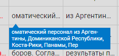
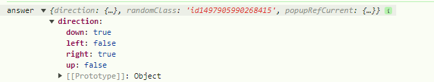
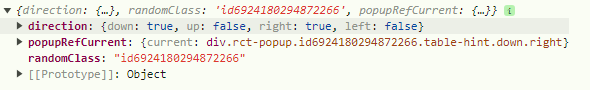

# POPUP

Всплывающая панель с кастомным содержимым

Посроение всплывающей панели осуществляется двумя способами:

1. **встраиванием в JSX** непосредственно самой компоненты:
    ````
    <Popup {...popupProps}>
        <Content ... />
    </Popup>
    ````
2. **вызовом функции из JS** с указанием в параметрах **portal** - места, где таблица должна будет разместиться в DOM-дереве:

    ````
    const portal = document.querySelector('#abcd');
    const {removeComponent} = callPopup({portal, ...popupProps});
    ````
    во втором случае в ответе получаем **removeComponent** - функцию удаления компоненты
    из DOM-дерева и всего, что с ней связано

# ПАРАМЕТРЫ popupProps

| Имя                               | Тип       | Назначение                                                                        |
|-----------------------------------|-----------|-----------------------------------------------------------------------------------|
| [portal](#portal)                 | DOM Node  | элемент DOM-дерева, в который будет добавлен HTML попапа                          |
| [initiator](#initiator)           | DOM Node  | элемент DOM-дерева, клик по которому привёл к созданию попапа                     |
| [children](#children)             | Component | внутреннее содержимое попапа                                                      |
| [id](#id)                         | String    | уникальное имя попапа                                                             |
| extraClass                        | String    | классы, которые будут присвоены корневому элементу попапа                         |
| style                             | Obj       | кастомные стили попапа                                                            |
| minWidth                          | Number    | Минимальная ширина                                                                |
| minHeight                         | Number    | Минимальная высота                                                                |
| maxWidth                          | Number    | Максимальная ширина                                                               |
| maxHeight                         | Number    | Максимальная высота                                                               |
| [notResize](#notresize)           | Bool      | отключить возможность изменения размеров попапа юзером                            |
| [autoSize](#autoSize)             | Bool      | размеры попапа будут определяться его содержимым                                  |
| [fitToParent](#fittoparent)       | Bool      | размеры и положени попапа будут равны размерам и положению родительского элемента |
| [onOutsideClick](#onoutsideclick) | Function  | колбэк при клике за пределами попапа                                              |
| [answer](#answer)                 | Function  | возврат дополнительной информации о попапе                                        |
| verticalOffset                    | Number    | смещение попапа по вертикали в пикселях                                           |

## portal
Применяется только в случае вызова компоненты из JS при помощи **callPopup()**

Параметр определяет, куда встроить компоненту в DOM-дереве. В случае отсутствия, компонента будет 
размещена последним элементом в **\<body\>**...**\</body\>**

## initiator
В большинстве случаем это элемент DOM-дерева, клик по которому вызвал открытие попапа. Но
в принципе может быть абсолютно любым элементом DOM-дерева

Смысл этого элемента в том, чтобы привязаться к его координатам на экране. Компонента сама 
определит сколько свободного места есть справа/слева/сверху/снизу от этого элемента на экране и
выведет попап в наиболее подходящем углу относительно инициатора

## children
Содержимое внутри попапа

При вызове попапа из **JS** через **callPopup**, это единственный способ задать содержимое
````
callPopup({
    ...popupProps,
    children: <Content ... />
});
````
При вызове из **JSX** задать содержимое можно как через параметр children

````
<Popup 
    {...popupProps}
    children: <Content ... />
/>
````

так и поместив её внутрь тэга
````
<Popup {...popupProps}>
    <Content ... />
</Popup>
````
Это равнозначные способы

## id
Уникальное имя, под котрым в localeStorage будут сохраняться размеры данного попапа

Если на задан, сохраняться и восстанавливаться 
установленные пользователем размеры попапа не будут

## notResize
По умолчанию попап предоставляет пользователю возможность менять его размеры. Если установлен 
notResize, то эта возможность отключается

## autoSize
Если установлен этот параметр, то размеры попапа будут определяться его содержимым. При этом 
параметры **minWidth**, **minHeight**, **maxWidth**, **maxHeight** учитываться не будут

## fitToParent
Если установлен этот параметр, то размеры попапа и его местоположение будут ровно 
такими-же, как его родительский элемент

Может использоваться, наример, когда необходимо открыть окно редакции ровно поверх ячейки
ровно в её пределах

Если установлен, то параметры **minWidth**, **minHeight**, **maxWidth**,
**maxHeight** и **autoSize** учитываться не будут

## onOutsideClick
Коллбэк, вызываемый в момент, когда пользователь ткнул мышкой за пределами попапа

Если необходимо в этот момент закрыть попап, который был открыт из
**JS** с помощью **callPopup**, то мужно воспользоваться 
функцией **removeComponent**, которую отдаёт **callPopup** после инициализации

## answer
На вход подаётся пустой объект. После инициализации попапа, в нём будут прописаны
некотороые параметры компоненты.

````
answer = {
    direction: {
        down: true,
        up: false,
        right: false,
        left: true,
    },
    randomClass: 'id5867243607040997';
    popupRefCurrent: {
        current: Node
    };
}
````
### direction
Если попап приниал решение, с какой стороны от инициатора открываться, то по содержимому
**direction** можно будет узнать куда именно он это сделал. Это бывает
полезно ели, например, мы хотим добавить "язычок" к попапу и не знаем с какой стороны его 
рисовать:




### randomClass
Если Ваш попап один из нескольких открытых и необходимо найти в DOM-дереве именно его,
то можно воспользоваться уникальным классом, который присваевается попапу в момент его открытия

Какой именно это класс можно узнать из **randomClass**

### popupRefCurrent.current
Тут будет лежать ссылка на элемент попапа в DOM-дереве

Только надо иметь ввиду, что появляется она только после
первой полной прорисовки попапа, так что ловить этот адрес надо с задержкой

