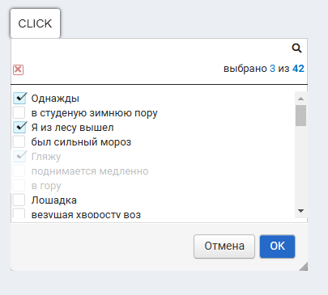

# POPUPLISTPICKER

Компонента позволяет выводить в всплывающем окне список элементов для одиночного или множественного выбора

````
<PopupListPicker {...popupListPickerProps}>
````



# ПАРАМЕТРЫ popupListPickerProps

Параметры компоненты условно можно разделить на три группы:

- **параметры для всплывающего окна**

| Параметр            | Аналог параметра [Popup](../../Popup/doc/POPUP.md#popup)  | Тип      | Назначение                                                        |
|---------------------|-----------------------------------------------------------|----------|-------------------------------------------------------------------|
| popupInitiator      | [initiator](../../Popup/doc/POPUP.md#initiator)           | DOM Node | элемент DOM-дерева, клик по которому привёл к созданию попапа     |
| popupName           | [id](../../Popup/doc/POPUP.md#id)                         | String   | уникальное имя попапа                                             |
| popupExtraClass     | extraClass                                                | String   | классы, которые будут присвоены корневому элементу попапа         |
| popupStyle          | style                                                     | Obj      | кастомные стили попапа                                            |
| popupMinWidth       | minWidth                                                  | Number   | Минимальная ширина                                                |
| popupMinHeight      | minHeight                                                 | Number   | Минимальная высота                                                |
| popupMaxWidth       | maxWidth                                                  | Number   | Максимальная ширина                                               |
| popupMaxHeight      | maxHeight                                                 | Number   | Максимальная высота                                               |
| popupNotResize      | [notResize](../../Popup/doc/POPUP.md#notresize)           | Bool     | отключить возможность изменения размеров попапа юзером            |
| popupAutoSize       | [autoSize](../../Popup/doc/POPUP.md#autoSize)             | Bool     | размеры попапа будут определяться его содержимым                  |
| popupOnOutsideClick | [onOutsideClick](../../Popup/doc/POPUP.md#onoutsideclick) | Function | колбэк при клике за пределами попапа                              |
|                     | [answer](../../Popup/doc/POPUP.md#answer)                 | Function | возврат дополнительной информации о попапе                        |

- **параметры для списка**

| Параметр            | Аналог параметра [ListPicker](../../ListPicker/doc/LISTPICKER.md#listpicker) | Тип       | Назначение                                                  |
|---------------------|------------------------------------------------------------------------------|-----------|-------------------------------------------------------------|
| list                | [list](../../ListPicker/doc/LISTPICKER.md#list)                              | Array     | список элементов для выбора                                 |
| listSelectedValue   | [selectedValue](../../ListPicker/doc/LISTPICKER.md#selectedvalue)            | String    | Список выбранных элементов                                  |
| listSelectedValues  | [selectedValues](../../ListPicker/doc/LISTPICKER.md#selectedvalues)          | Array     | Список выбранных элементов (альтернатива selectedValue)     |
| listOnChange        | [onChange](../../ListPicker/doc/LISTPICKER.md#onchange)                      | Function  | колбэк, вызываемый при изменении списка выбранных элементов |
| listIsMultiSelect   | isMultiSelect                                                                | Bool      | признак множественного выбора                               |
| listHideSearchBar   | [hideSearchBar](../../ListPicker/doc/LISTPICKER.md#hidesearchbar)            | Bool      | признак отрисовки области поиска                            |
| listHideCountersBar | [hideCountersBar](../../ListPicker/doc/LISTPICKER.md#hidecountersbar)        | Bool      | признак отрисовки области счётчиков                         |
| listItemView        | [ItemView](../../ListPicker/doc/LISTPICKER.md#itemview)                      | Component | Кастомныое представление строки списка                      |

- **параметры для кнопок**


| Параметр          | Аналог параметра [Alert](../../Alert/doc/ALERT.md#alert)      | Тип        | Назначение                                     |
|-------------------|---------------------------------------------------------------|------------|------------------------------------------------|
| buttons           | [buttons](../../Alert/doc/ALERT.md#buttons)                   | Array      | описание кастомных кнопок                      |
| removeComponent   | [removeComponent](../../Alert/doc/ALERT.md#removecomponent)   | Function   | вызов этой процедуры должен убивать компоненту |
